# The Art of The Flatline Sessions II

A visual catalog of the production artwork and its story context.

## IMG-001 — `the_flatline_sessions_ii_count_binary.png`

### Soundtrack album artwork

Album-cover asset retained with the game project; not displayed during normal play.

## IMG-002 — `C1_airstrip.png`

### Room — CH01 Smooth-Running Gun / Airstrip

A strip of oiled dirt and a chartered turboprop with its door hanging open like a question you've already answered. North is the border, the Sprawl, the site, the job.

INTERACTION — Board the Hosaka charter
The pilot checks your face against a retinal token and never asks for a name. Inside, six seats have been reduced to two, leaving room for encrypted communications gear and a restraint frame sized for a human body. The frame is folded flat, but its presence tells you what sort of return flight Hosaka planned.
The coast drops away beneath the wing. From altitude the beach house becomes a white mark between road and water, convincing only because distance hides the cameras. Allison is nowhere visible. You tell yourself that not looking longer is a professional choice.
North waits the border, the desert, and a mall emptied by an older economic disaster. You fasten the belt while the repaired bones in your chest register the engines as a vibration they have never felt before.

INTERACTION — Study the Arizona site feed
A preflight terminal wakes beside the charter stairs. Satellite imagery shows a dead mall beside a prewar highway, its roof peeled open in places by heat. Hosaka has hidden the command bunker beneath an old department store and parked the surgical pod where delivery trucks once unloaded appliances.
The mesa lies beyond the horizon, owned entirely by Maas. Mitchell is meant to cross that distance in an ultralight too small for radar, descending along an obsolete power corridor. At dawn the site will catch him, stabilize him, and move him to the waiting jet before Maas understands what has happened.
It is a beautiful plan in the way diagrams are beautiful. The feed does not show heat shimmer, frightened people, faulty equipment, or an enemy who has read the same terrain. You begin adding those things in your head until the clean arrows look like possible lines of fire.

INTERACTION — Review the extraction crew
Sutcliffe's record is military and aggressively ordinary: perimeter work, corporate border actions, three contracts whose locations have been erased. His evaluations praise discipline and note that he asks for complete threat models. Conroy has given him the same incomplete file he gave you.
Webber appears under four surnames. Communications, intrusion, field intelligence. One photograph catches her looking away from the camera as if she has already found the person taking it. Her last two teams completed their assignments and dissolved without reunions.
The medical staff are almost blank. Their equipment manifest is not. The pod can replace blood, suppress immune response, and keep a shattered subject alive long enough to reach a better clinic. Hosaka expects Mitchell to arrive injured—or expects somebody else to need the machinery afterward.
Conroy's own page contains no history at all, only current authority. You shut down the feed as the desert appears beneath the wing. By the time you meet the crew, you know enough to distrust all of them and just enough to understand that some may deserve it less than others.

### Outro page 2 — CH01 Smooth-Running Gun

Allison is gone; the beach was a set, and the set is struck. You board the flight north with the taste of copper in your mouth and the job unfolding in your head like a map of everything that can go wrong.

## IMG-003 — `C1_beach.png`

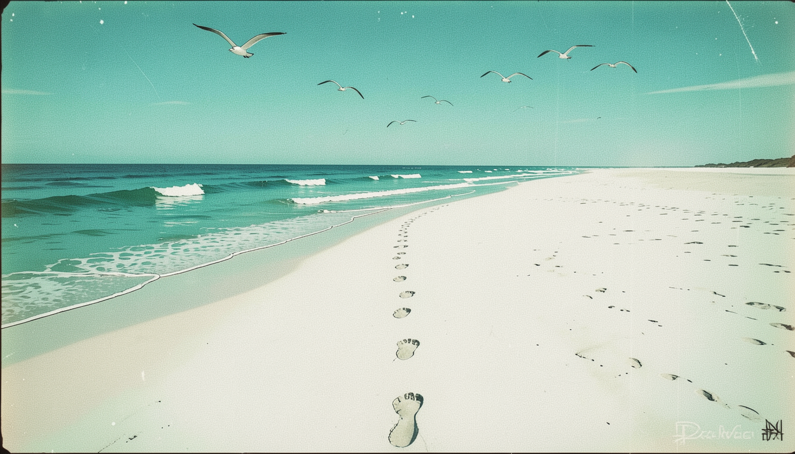

### Room — CH01 Smooth-Running Gun / The Beach

A long white curve of sand with nobody on it but the gulls — and Allison, walking the tideline with her sandals in one hand, exactly as if this were a life either of you got to keep.

## IMG-004 — `C1_bedroom.png`

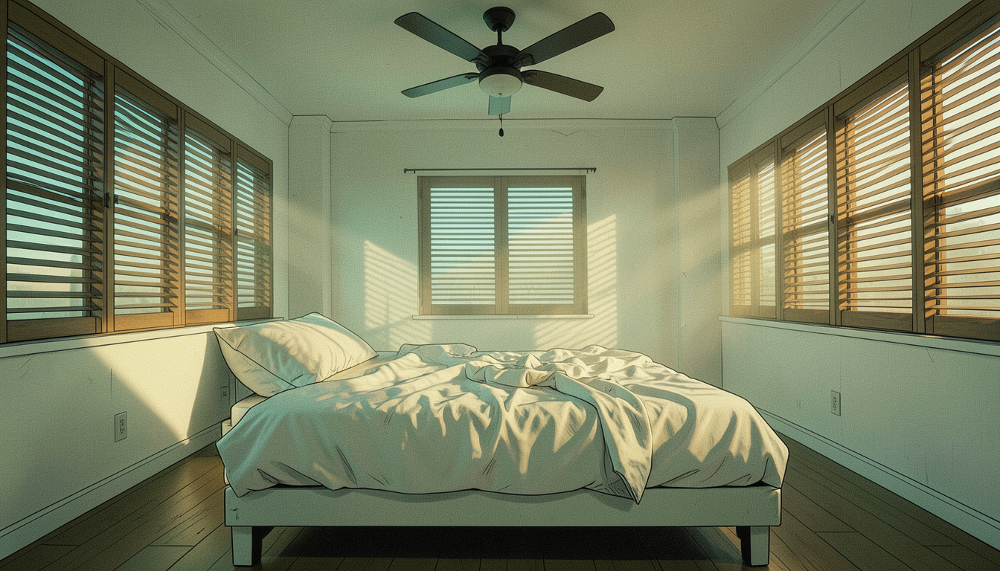

### Room — CH01 Smooth-Running Gun / Beach House — Bedroom

White walls, a ceiling fan turning slow, salt on the sea wind through the shutters. Three months of surgical reconstruction ended in this bed. The room is restful in the calculated way of a clinic brochure, and nothing in it belongs to you.

INTERACTION — Examine the clinic's work
The mirror gives you the inventory. The face is yours because the surgeons had records, but the left cheek carries a fraction more weight and one eye catches the light differently. Beneath the robe, pale seams cross your ribs and vanish into new-grown skin. You remember none of the procedures. You remember New Delhi as light, noise, and then an animal shape coming through a hotel door.
The Dutch clinic taught you to walk by making the floor tilt under you. It taught your hands with blocks, wire, and finally a disassembled pistol. Muscle memory returned before affection, appetite, or sleep. The doctors celebrated each recovered reflex without asking what the reflex had once been used for.
Your pulse remains steady while you inspect the scars. That steadiness is part of the reconstruction too: glands tuned, panic response shaved down, pain routed into something cold and usable. Whoever paid did not merely want Turner alive. They wanted the extraction specialist put back into service.

INTERACTION — Search the bedside cabinet
The drawer holds clinic gauze, a hotel Bible in Spanish, and a folded thermal sheet somebody forgot to destroy. Most of the printing has faded, but the authorization block remains readable: HOSAKA BIOTECHNICAL, SPECIAL PROJECTS. The amounts are expressed in corporate accounting codes rather than money.
There are line items for vat growth, spinal reconstruction, endocrine conditioning, and psychological stabilization. The final entry is not medical at all: MEXICO RECOVERY ENVIRONMENT, SIX WEEKS, ASSET OBSERVATION INCLUDED. Allison's name does not appear. She has been entered as a service category.
You fold the sheet along its old crease. Conroy has not arrived yet, but his hand is already visible. Somebody bought the beach, the house, the woman, and the repaired body standing over the drawer. The only missing entry is the job that makes the expense worthwhile.

## IMG-005 — `C1_cantina.png`

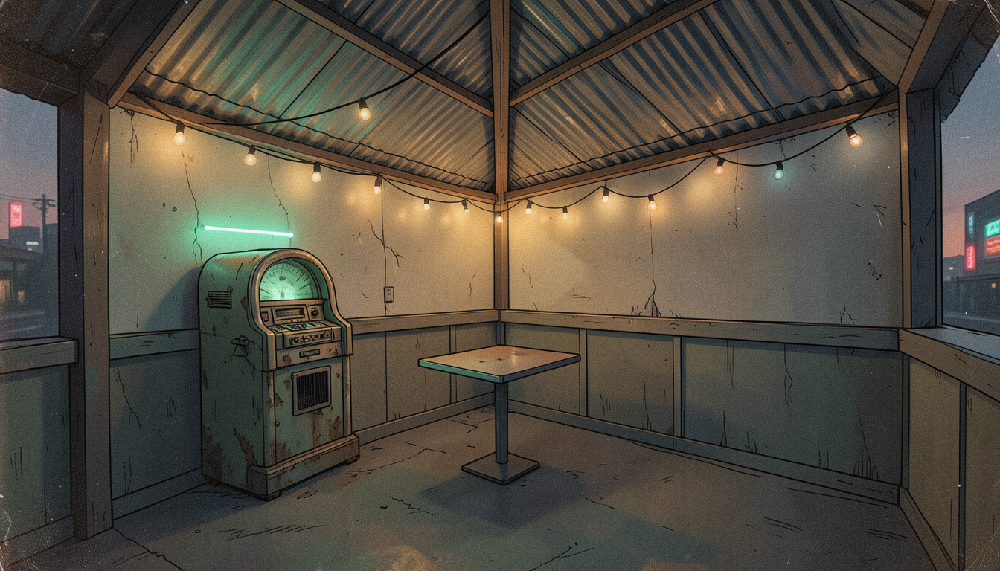

### Room — CH01 Smooth-Running Gun / Cantina

Tin roof, warm beer, a dead jukebox. The man waiting at the corner table has a new face since you saw him last, but the smile underneath it hasn't improved: Conroy, who finds people for money, and has found you.

INTERACTION — Open the Mitchell dossier
The chip paints Christopher Mitchell's professional life across your field of vision. Patents, conference footage, sealed Maas appointments. His work made living cells carry functions once assigned to silicon. Every corporation on the board wants the process, and Maas has buried its inventor inside an Arizona mesa.
The extraction plan is precise where machinery is concerned: ultralight flight path, perimeter frequencies, surgical pod, aircraft on standby. Where it concerns Mitchell himself, the file becomes fog. No current medical scan. No verified photograph. No explanation for how a man under total biological security contacted Hosaka—or why he requested Turner by name.
A personnel appendix lists specialists already assembling at a dead shopping mall: Sutcliffe on perimeter defense, Webber handling communications, a medical team without biographies, Conroy above everyone. The document calls them independent contractors. In your trade that often means witnesses selected for disposability.
You close the file knowing two things. The extraction is real, and the account of it is not. If you take the job, survival will depend on learning which missing fact Conroy expects to kill you.

## IMG-006 — `C1_road.png`

### Room — CH01 Smooth-Running Gun / Coast Road

A cracked two-lane running north into haze. A rusted sign promises a town that mostly is not there anymore. The sea is invisible behind the palms, and your body has already begun measuring sightlines and places where a vehicle could wait.

INTERACTION — Sweep the road for surveillance
You walk north without looking hurried. A delivery van has passed twice since dawn, too clean for the village and carrying no company mark. Farther up, fresh tire cuts cross the dust beside an abandoned filling station. Somebody parked there through the night with a clear view of the house road.
At the cantina turnoff you find a fiber no thicker than hair caught under a stone. It leads to a discarded pickup smaller than a fingernail: passive optics, corporate quality, already wiped. The watcher wanted to know when you left the beach, not where you went afterward.
That means the meeting ahead is not an invitation. It is the next scheduled phase. You leave the pickup where it lies and continue toward the cantina, giving the unseen observer exactly the picture they expected.

## IMG-007 — `C1_tidepools.png`

### Room — CH01 Smooth-Running Gun / Tide Pools

Black volcanic rock full of small green worlds. Anemones, brittle stars, a crab working its patient trade. Each pool is complete until the next wave breaks over it. The fragile order makes you think of bodies, teams, and plans.

INTERACTION — Test what the clinic restored
You crouch above a pool and begin naming what you see in three languages. Spanish arrives warm from the microsoft, laid over the older words without quite touching them. Beneath the names, procedural memory supplies tide tables, concealment angles, the weight of a compact pistol wet with salt.
Then come the involuntary fragments: a rooftop in Singapore; a scientist crying inside a freight elevator; the smooth pressure of a trigger while somebody else counts down. The clinic returned the skills in sealed compartments. The memories leak through at their edges.
A wave floods the pool and every small animal holds fast. You understand the lesson without liking it. Reconstruction did not make you new. It made you continuous enough for whoever owned the old obligations to collect them.

## IMG-008 — `C1_veranda.png`

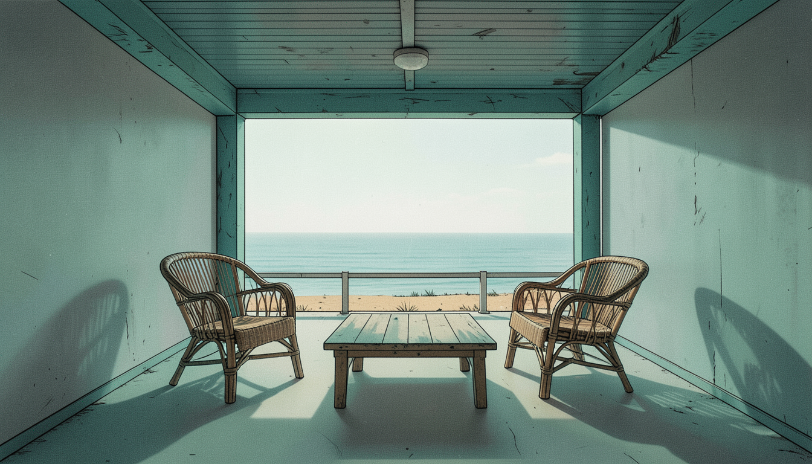

### Room — CH01 Smooth-Running Gun / Beach House — Veranda

Bleached boards, two chairs, a table with yesterday's glasses. Below, the Pacific rolls in the way it has since before anyone owned anything. The house is positioned to make the horizon unavoidable and the road behind it easy to forget.

INTERACTION — Read the house like an operation
Once you stop treating the veranda as a place to recover, its choices become obvious. The chairs face the water but leave both doors in peripheral view. The rail is low enough to clear in one movement. A dark lens no larger than a nail head watches the beach path from beneath the eave.
The kitchen is stocked with foods from a rehabilitation profile you never filled out. The bottles are expensive but measured. Even the loose board by the stairs is theatrical: it squeaks loudly enough to announce anyone coming up from the sand. A security designer has built an idyll from the same principles as a safe house.
You feel no anger yet. Anger is expensive before the shape of the operation is known. You catalogue the lens, the road, the distance to the airstrip, and Allison below at the tideline. Then you go to hear which parts of the set she knows are false.

## IMG-009 — `C2_alley.png`

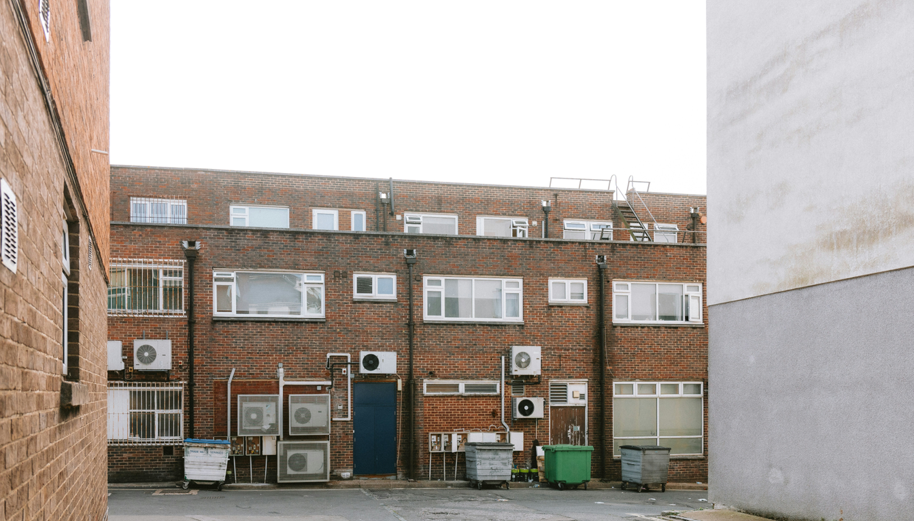

### Room — CH02 Bobby Pulls a Wilson / Service Alley

You're two blocks gone when the sixteenth floor of the Covina Courts blows out in a rose of flame and glass. Your floor. Your window. Everything you own is burning confetti, and whoever did it thinks you were inside.

## IMG-010 — `C2_bedroom.png`

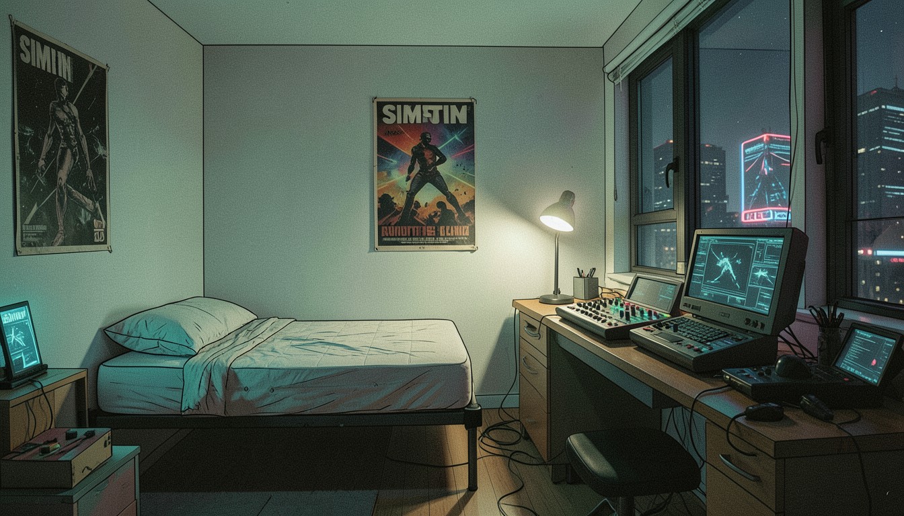

### Room — CH02 Bobby Pulls a Wilson / Your Room

A mattress, a poster of Tally Isham, and the Ono-Sendai you'd sell a kidney to upgrade. Handle: Count Binary Interrupt. Runs completed: zero. Tonight that number changes.

INTERACTION — Look around before the run
The room is a museum of intended escape: cowboy magazines, hand-copied ICE diagrams, and a Tally Isham poster concealing the stain where the wall leaks. Your mother calls the deck a toy because admitting its price would mean admitting what you plan to become. Count Binary Interrupt is written inside the case in marker, a handle waiting for evidence.

INTERACTION — Monitor the Barrytown boards
The local board treats first runs as comedy until somebody dies. Veterans trade contradictory rules: never borrow software, never trust a broker, never hit a target you cannot name. Two-a-Day's node is absent from every warning, which feels less like innocence than careful maintenance. You disconnect before caution can become good sense.

## IMG-011 — `C2_hall.png`

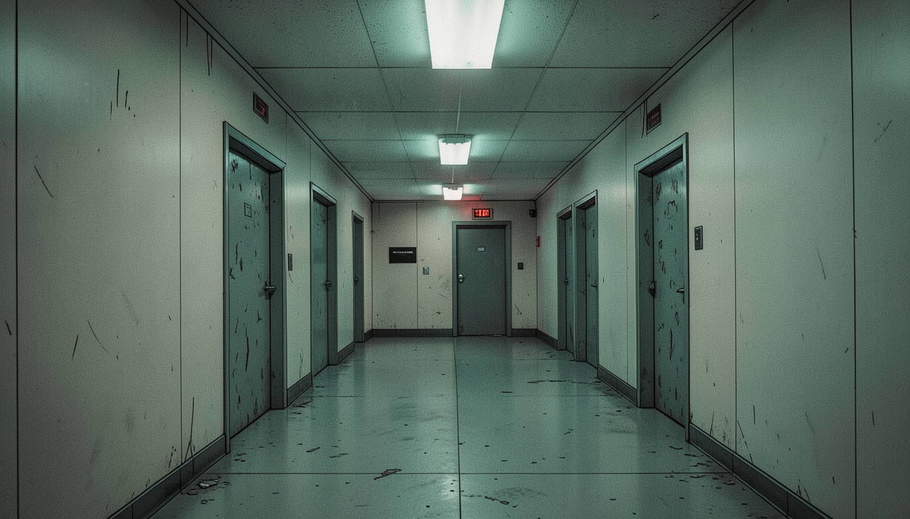

### Room — CH02 Bobby Pulls a Wilson / Covina Concourse Courts — Hallway

Piss-yellow light, doors the color of old teeth, the elevator that works on alternate Tuesdays. Sixteen floors of people pretending not to hear each other's lives.

### Outro page 2 — CH02 Bobby Pulls a Wilson

Then your mother's condo went up in a fireball with everything you owned, and Barrytown stopped being home. Two-a-Day's people are looking for you. So are the ones who blew the window out.

## IMG-012 — `C2_leons.png`

### Room — CH02 Bobby Pulls a Wilson / Leon's

Nominally a bar, actually a switchboard: everything in Barrytown that's for sale but shouldn't be moves through Leon's back room. Leon owes Two-a-Day a favor, and tonight the favor is you.

## IMG-013 — `C2_living.png`

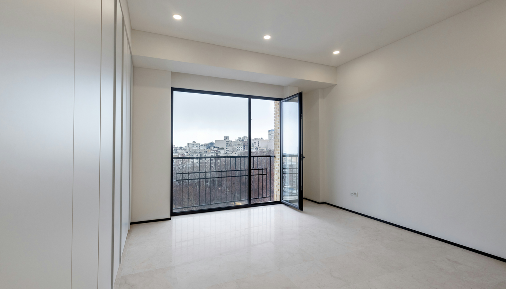

### Room — CH02 Bobby Pulls a Wilson / Condo — Living Room

Your mother's Hitachi projects a soap opera into the middle of the room; the couch remembers her shape. The phone jack by the window is where you'll fly from. Marsha next door has the volume up on the same show, half a beat behind.

### Outro page 3 — CH02 Bobby Pulls a Wilson

You wanted a handle. Congratulations: whatever touched you in the ice knows your name now.

## IMG-014 — `C2_playground.png`

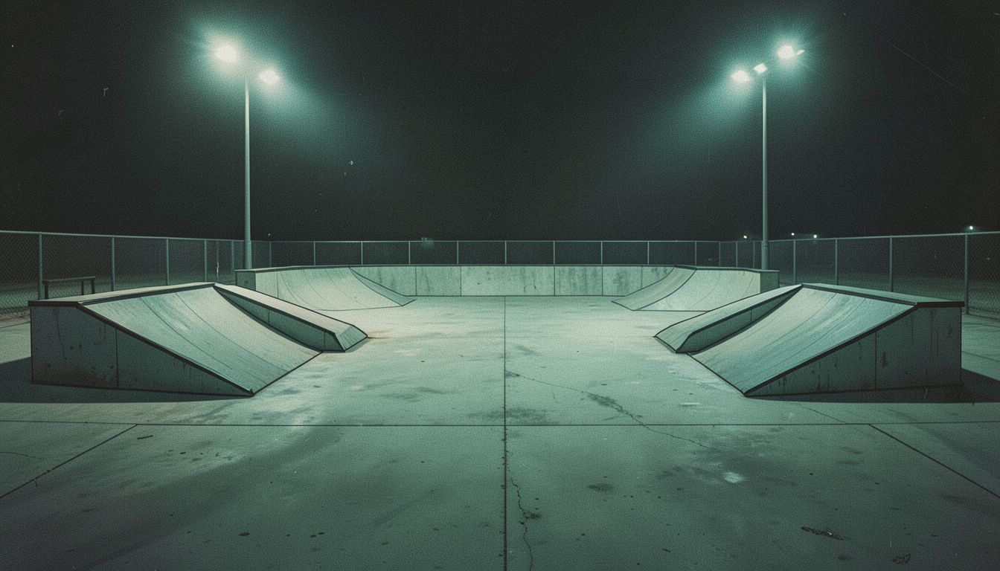

### Room — CH02 Bobby Pulls a Wilson / Big Playground

The concrete park under the arc lights, empty at this hour except for the wind and one girl with a mohawk watching you from the swings like she was sent to. Nowhere left to go but forward.

## IMG-015 — `C2_street.png`

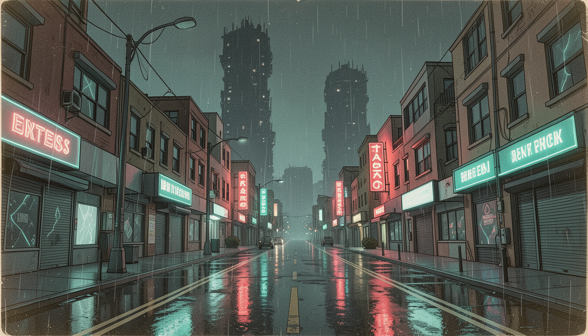

### Room — CH02 Bobby Pulls a Wilson / Barrytown Street

Big Playground glows off to the east; the Projects stack black against the sky beyond it, lightless and vast, like the future deciding whether to notice you. Gothicks drift past in twos and threes, all hair and attitude.

## IMG-016 — `C3_andrea.png`

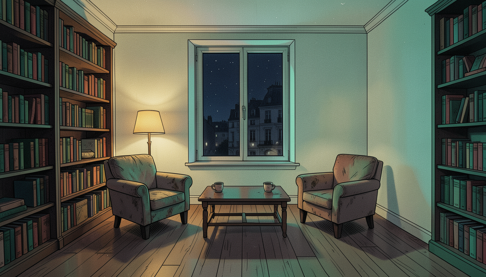

### Room — CH03 Virek's Garden / Andrea's Flat

Books on every surface, a couch that knows you, coffee in mismatched cups. Andrea listens the way nobody in the gallery world ever has: to find out what's true.

## IMG-017 — `C3_cafe.png`

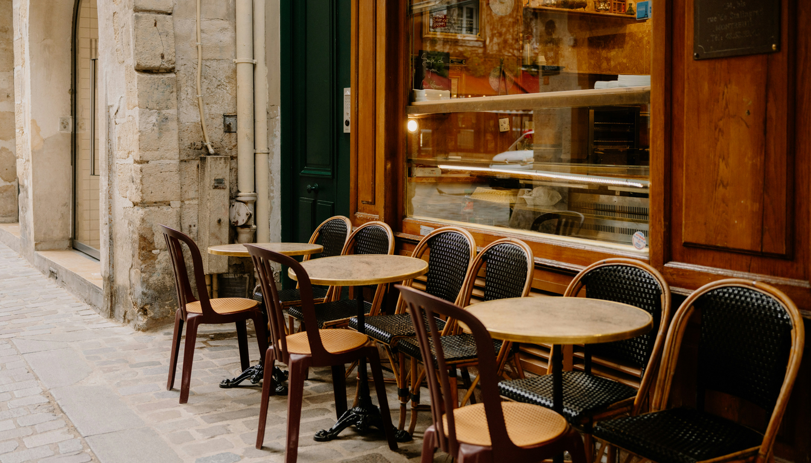

### Room — CH03 Virek's Garden / Café Blanc

Marble tables, bitter espresso, a terminal by the register older than the waiter. From the corner seat you can watch the whole street — which matters now, because the whole street is watching you back.

## IMG-018 — `C3_construct.png`

### Room — CH03 Virek's Garden / Virek's Garden — Parque Güell

A sensory link, and then Barcelona: Gaudí's serpentine bench, tiled dragons, sun that has been dead for hours falling warm on your arms. Josef Virek sits on the bench feeding pigeons that don't exist. His body is a shed of support vats in Stockholm. This is where he lives.

## IMG-019 — `C3_gallery.png`

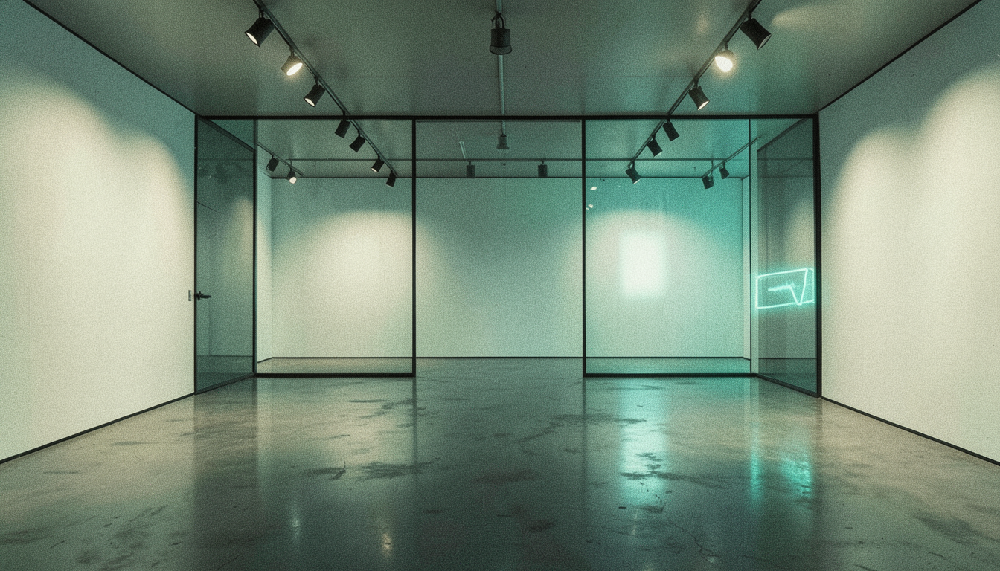

### Room — CH03 Virek's Garden / Galerie Duperey — Interview

Glass, steel, and money too old to raise its voice. The receptionist's smile is exactly four percent warm. You are one scandal deep and they made you wait forty minutes to be sure you felt it.

INTERACTION — Review the forged box dossier
The old images still produce the same shame: a Cornell-like box, impeccable aging, persuasive provenance, and Alain's assurances arranged around it like flowers at a funeral. You had wanted discovery badly enough to mistake desire for judgment. Virek has hired that wound as much as he has hired your eye.

INTERACTION — Study the construct's seams
The sunlight is too even and the pigeons repeat their smallest gestures. Beyond the tiled bench, Barcelona dissolves into choices made by a designer: what Virek remembers, what he purchased, what he wishes visitors to believe. A dying man has built himself a garden without decay and still cannot stop speaking about escape.

### Outro page 1 — CH03 Virek's Garden

A commission without limit: find the boxmaker. Virek's money opens every door in Paris and his agents stand in every doorway you pass.

## IMG-020 — `C3_street.png`

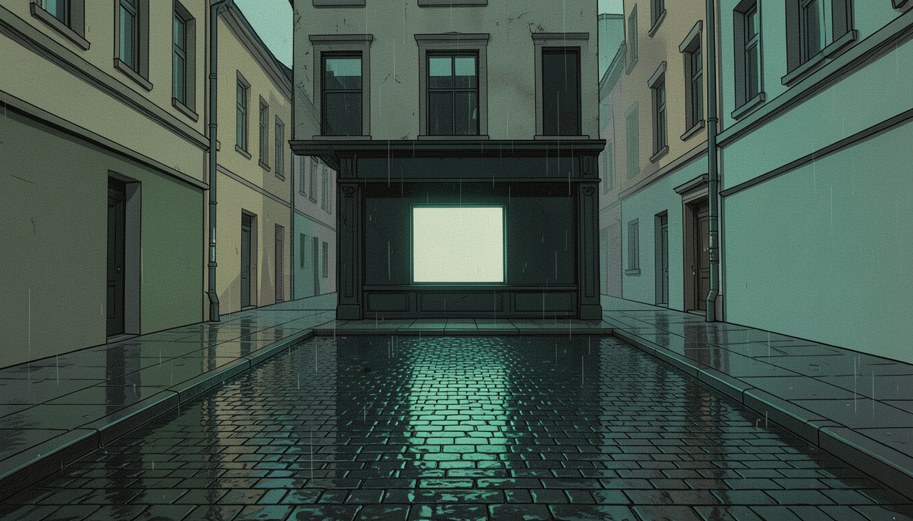

### Room — CH03 Virek's Garden / Brussels — Rue au Beurre, Rain

Grey rain on grey stone, your best coat soaked past saving. In a shop window, thirty screens replay a simstim star's smile. Every taxi in the city is somewhere else.

### Outro page 3 — CH03 Virek's Garden

Paco is watching you from across the street. He'll be watching tomorrow, too.

## IMG-021 — `C3_ternes.png`

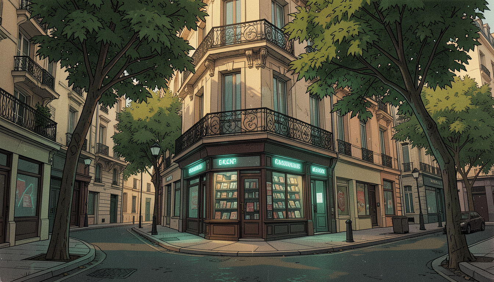

### Room — CH03 Virek's Garden / Quartier des Ternes

Andrea's street: chestnut trees, dog-eared bookshops, an old man selling roasted things from a cart. The city that ruined you, smelling like the only home you've got.

## IMG-022 — `C3_train.png`

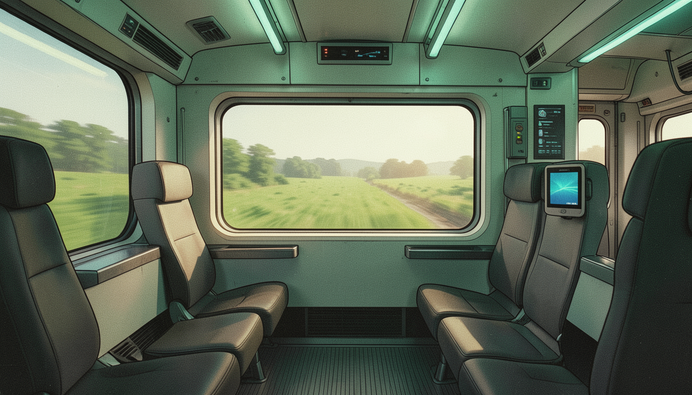

### Room — CH03 Virek's Garden / TGV — Brussels to Paris

The flat country pours past at three hundred kph. In the seatback screen your own face looks out from an art-world scandal retrospective, four months old and still warm. Paris will know you before you arrive. Paris always did.

## IMG-023 — `C4_bunker.png`

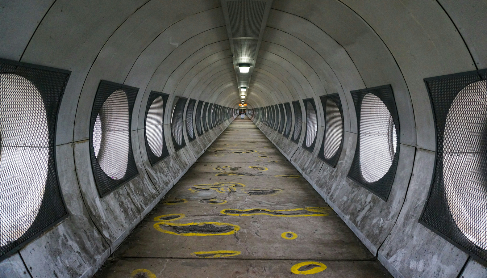

### Interaction art — Study the Arizona site feed

The mesa lies beyond the horizon, owned entirely by Maas. Mitchell is meant to cross that distance in an ultralight too small for radar, descending along an obsolete power corridor. At dawn the site will catch him, stabilize him, and move him to the waiting jet before Maas understands what has happened.

### Interaction art — Study the Arizona site feed

It is a beautiful plan in the way diagrams are beautiful. The feed does not show heat shimmer, frightened people, faulty equipment, or an enemy who has read the same terrain. You begin adding those things in your head until the clean arrows look like possible lines of fire.

### Room — CH04 On Site / Command Bunker

A buried room lit by console glow: site schematics, comm gear, Conroy's voice on a secure line whenever it suits him. The air tastes of concrete and old fear. Everything is planned. That's what worries you.

## IMG-024 — `C4_crash.png`

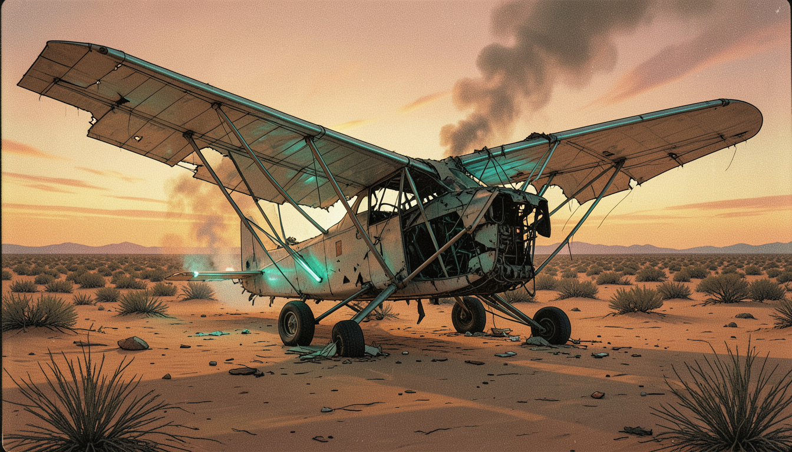

### Room — CH04 On Site / Crash Site

The ultralight is a torn kite burning in the scrub. In the wreckage: not Christopher Mitchell. A girl — sixteen, unconscious, pulse thready, blood at her hairline. Behind you, over the mesa, the sky is starting to turn the wrong color.

### Outro page 1 — CH04 On Site

The ultralight came in burning. What they pulled out of the crash wasn't Christopher Mitchell — it was his daughter, unconscious, with something grown into her head that the medical pod's scanners refused to name.

## IMG-025 — `C4_jet.png`

### Room — CH04 On Site / The Jet

You strap the girl into the copilot couch as the first strike comes down on the site behind you — a white flower with a stem of smoke, your whole team inside it. The jet's AI asks, politely, where you would like to go.

### Outro page 3 — CH04 On Site

You came out of it with a jet, a sixteen-year-old girl, and the absolute certainty that everyone involved in this job was always meant to be dead by now.

## IMG-026 — `C4_mall.png`

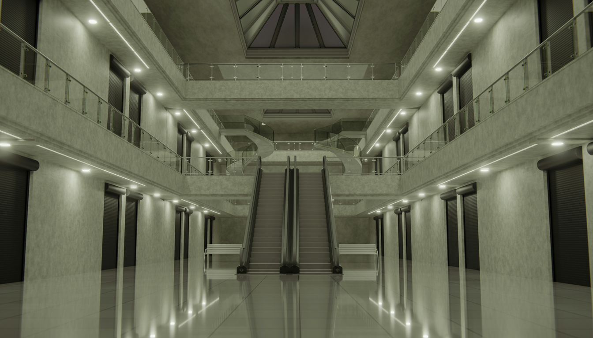

### Interaction art — Study the Arizona site feed

A preflight terminal wakes beside the charter stairs. Satellite imagery shows a dead mall beside a prewar highway, its roof peeled open in places by heat. Hosaka has hidden the command bunker beneath an old department store and parked the surgical pod where delivery trucks once unloaded appliances.

### Room — CH04 On Site / Dead Mall Concourse

A shopping mall the desert has been eating for fifty years. Sand drifts through shattered skylights across the food court. Your team moves through the ruins like ghosts with clipboards.

INTERACTION — Walk the mall as a battlefield
The concourse offers long fields of fire and almost no honest cover. Storefront mirrors multiply movement; service corridors bypass every checkpoint; the broken roof gives anything airborne a view straight into the operation. Conroy chose concealment from civilians, not defense from Maas. Those are not the same problem.

INTERACTION — Audit the pod manifest
The official manifest describes a defector arriving intact. The sealed drawers prepare for something else: synthetic blood, cranial stabilization, immune suppressants, restraints sized for a smaller patient. Somebody planned for catastrophic injury and somebody may have known Mitchell would not be the body on the table.

## IMG-027 — `C4_medpod.png`

### Interaction art — Review the extraction crew

The medical staff are almost blank. Their equipment manifest is not. The pod can replace blood, suppress immune response, and keep a shattered subject alive long enough to reach a better clinic. Hosaka expects Mitchell to arrive injured—or expects somebody else to need the machinery afterward.

### Interaction art — Review the extraction crew

Conroy's own page contains no history at all, only current authority. You shut down the feed as the desert appears beneath the wing. By the time you meet the crew, you know enough to distrust all of them and just enough to understand that some may deserve it less than others.

### Room — CH04 On Site / Surgical Pod

A mobile neurosurgery riding on a flatbed: white light, chrome, the smell of iodine and cold. The medicals check their instruments in silence. Whatever comes over the wire at dawn lands on this table first.

## IMG-028 — `C4_pad.png`

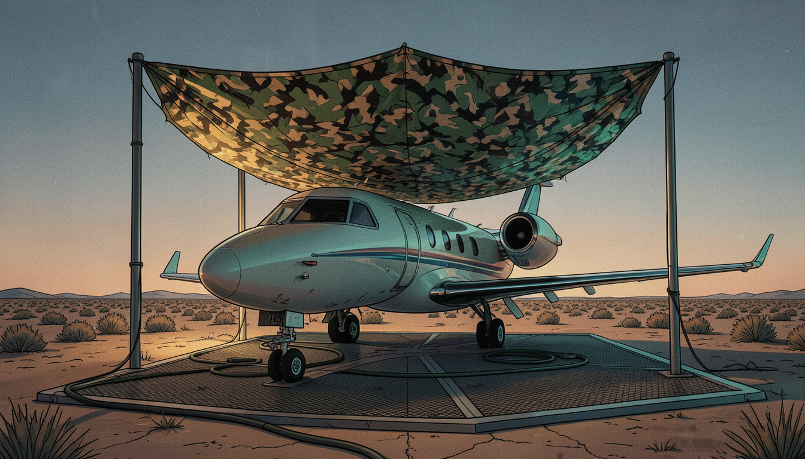

### Room — CH04 On Site / Landing Pad

The jet crouches under camo netting, fueled, preflighted, pointed at the sky like a held breath. The exit. You've never trusted a plan whose exit you didn't pick yourself.

## IMG-029 — `C4_perimeter.png`

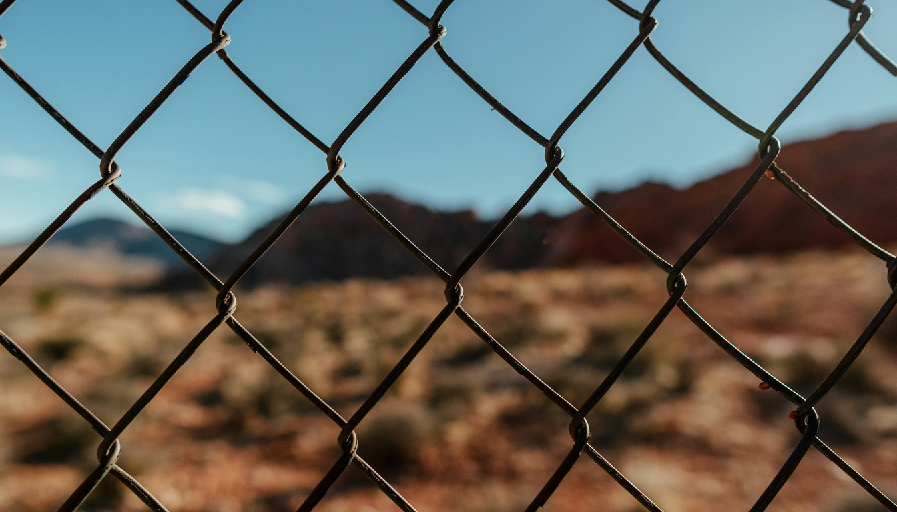

### Interaction art — Review the extraction crew

Sutcliffe's record is military and aggressively ordinary: perimeter work, corporate border actions, three contracts whose locations have been erased. His evaluations praise discipline and note that he asks for complete threat models. Conroy has given him the same incomplete file he gave you.

### Room — CH04 On Site / Perimeter — The Wire

Sensor stakes and monofilament out to the highway, the mesa a black wall on the horizon. Sutcliffe walks the line with his rifle slung, pointing out arcs of fire like a man showing you his garden.

## IMG-030 — `C4_ridge.png`

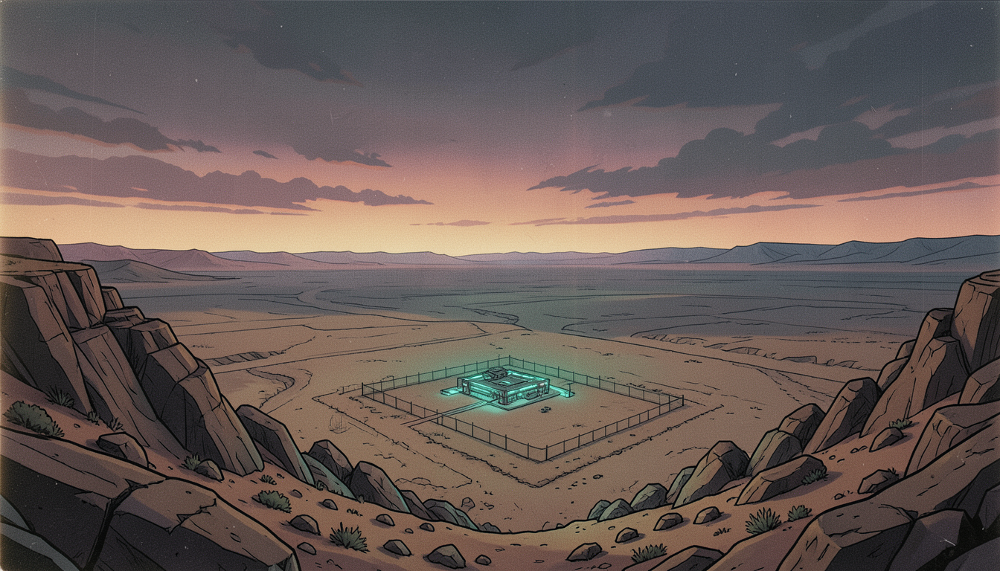

### Interaction art — Review the extraction crew

Webber appears under four surnames. Communications, intrusion, field intelligence. One photograph catches her looking away from the camera as if she has already found the person taking it. Her last two teams completed their assignments and dissolved without reunions.

### Room — CH04 On Site / Ridge Lookout

From up here the site is a diagram of itself: bunker, pad, pod, wire. Webber sits against a rock with her scope, chewing a match, watching the team more than the desert.

## IMG-031 — `C5_altar.png`

### Room — CH05 The Projects / Hounfor — Altar Room

Candles, chromed vévé traced in flour on the floor, a bottle of rum beside a keyboard older than you are. Beauvoir calls it a hounfor — a server room for gods. He says both words like they mean the same thing, because to him they do.

INTERACTION — Study the altar's circuitry
Copper traces disappear beneath flour symbols and return beside candles burned down over old circuit boards. Nothing here separates ritual from engineering. Each offering is also an interface, each name also an address. The arrangement makes your deck look less advanced, not more.

INTERACTION — Study the Projects map
A hand-drawn wall map turns the supposedly empty towers into kitchens, workshops, schools, markets, and hounfors. Barrytown occupies one tired corner below. You spent your life imagining the Projects as a void; the map shows a city doing business with intelligences the corporations insist do not exist.

## IMG-032 — `C5_elevator.png`

### Room — CH05 The Projects / Down Elevator

The doors stand open on a car big enough for freight. Lucas waits inside in a suit the color of midnight, holding a cane he doesn't need, patient as a scheduled eclipse.

## IMG-033 — `C5_gallery.png`

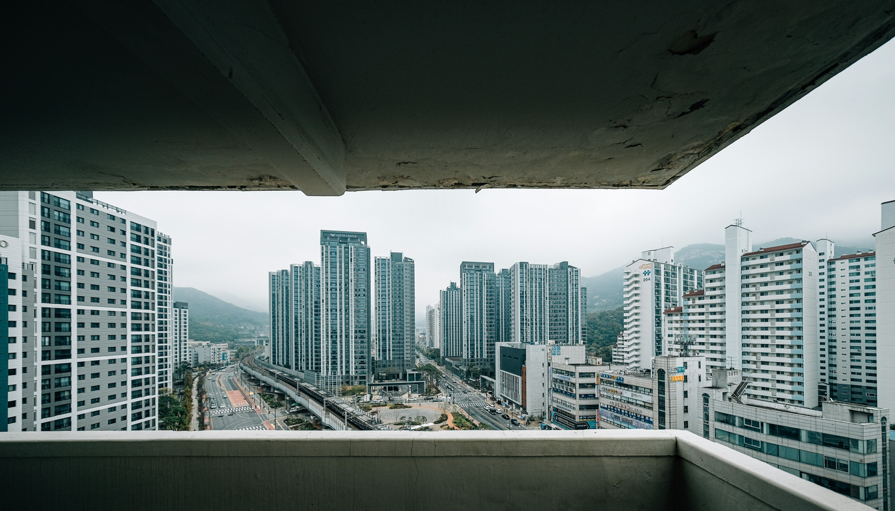

### Room — CH05 The Projects / Projects Gallery — View of Barrytown

A windowed walkway a kilometer up. Barrytown is a circuit board below, the Sprawl a glow on the horizon like a permanent dawn. A public terminal hums by the rail.

## IMG-034 — `C5_kitchen.png`

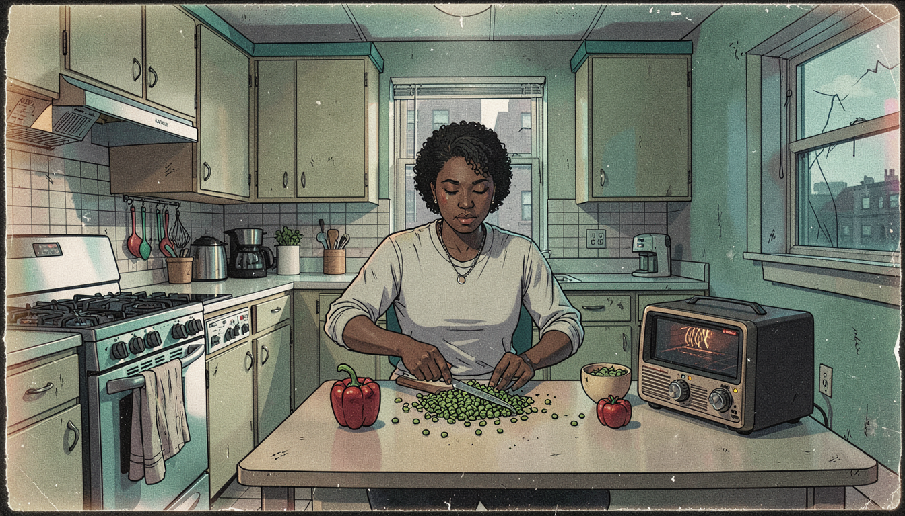

### Room — CH05 The Projects / Rhea's Kitchen

Steam, scotch bonnet, a radio playing dub at conversation volume. Jackie shells peas at the table with the unhurried grace of someone who is also, on other nights, a horse for gods to ride.

## IMG-035 — `C5_recovery.png`

### Room — CH05 The Projects / Recovery Room

You wake on a fold-out table under a hand-stitched quilt, bandaged by someone who knew what they were doing. The window looks out from a height Barrytown doesn't have: you're up in the Projects, where nobody from the Courts ever goes twice.

### Outro page 3 — CH05 The Projects

Lucas is taking you into the Sprawl. You're on the payroll of gods now, Count. Try not to pull another wilson.

## IMG-036 — `C5_twoaday.png`

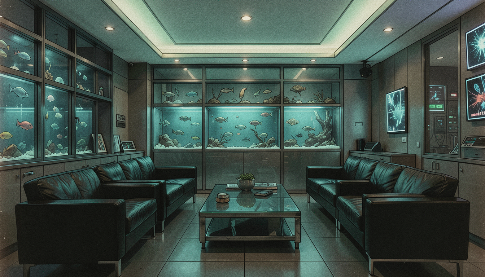

### Room — CH05 The Projects / Two-a-Day's Apartment

Leather, chrome, a wall of fish tanks, and Two-a-Day himself looking significantly less rich and significantly more scared than he did in Barrytown. Your deck sits on his coffee table like evidence.

## IMG-037 — `C6_alain.png`

### Room — CH06 Names of the Dead / Alain's Flat

The door stands a centimeter open. Inside, the rented room is neat except for Alain, who is sitting in the good chair with a third eye that never blinks. Whoever did this searched nothing — they knew he'd carry it on him. They were wrong. He taped it inside his coat, like an amateur, like Alain.

### Outro page 1 — CH06 Names of the Dead

Alain is dead in his rented flat, shot through the eye, the lead still folded in his coat: coordinates. High orbit. The old Tessier-Ashpool cores, sold off and rotting at the far end of the Freeside archipelago.

## IMG-038 — `C6_andrea.png`

### Room — CH06 Names of the Dead / Andrea's Flat

Morning light through tall windows, coffee going cold beside Virek's dossier. Andrea watches you dress for a meeting with the man who broke your career and asks, gently, if you're sure.

INTERACTION — Arrange the box provenance notes
Names and sales form a trail designed to look accidental: collectors who never met, galleries that handled one object and closed, payments routed through dead companies. The boxes move like messages passed hand to hand. Every owner believes they purchased an artwork; none asks whether the artwork was traveling somewhere.

INTERACTION — Review Andrea's street-camera loop
Andrea's security loop caught Paco outside before dawn. He watches reflections instead of faces and keeps the street on one side so nobody can approach unseen. His protection is competent, conspicuous, and meant to remind you that Virek's reach is a physical fact. Twice he checks a figure who is watching him back.

## IMG-039 — `C6_brasserie.png`

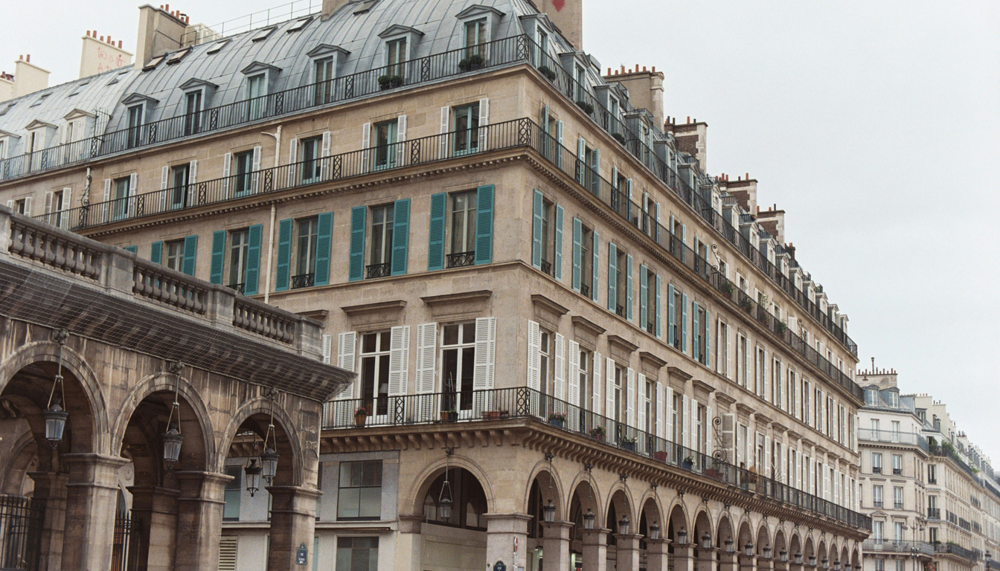

### Room — CH06 Names of the Dead / Brasserie — Napoleon Court

Fifth sublevel, brass and old mirrors, the crowd all lawyers and gallery boys. Alain has taken the best table and ordered the most expensive thing on the card, secure in the knowledge that you're paying. Some men never change; it's their only virtue.

## IMG-040 — `C6_louvre.png`

### Room — CH06 Names of the Dead / Louvre Embankment

The Seine sliding grey under a white sky. Paco falls into step beside you without appearing to arrive, coat collar up, apologetic as a knife in a velvet box.

## IMG-041 — `C6_orly.png`

### Room — CH06 Names of the Dead / Orly — JAL Concourse

Departure boards ripple: Freeside, the archipelago, the high frontier. Your reflection in the glass carries a dead man's coordinates and the unlimited credit of a man in a vat. A steward bows you toward the gate.

### Outro page 3 — CH06 Names of the Dead

There's a JAL shuttle out of Orly in the morning. You've stopped being an art dealer. You're a probe now, fired at the sky.

## IMG-042 — `C6_shuttle.png`

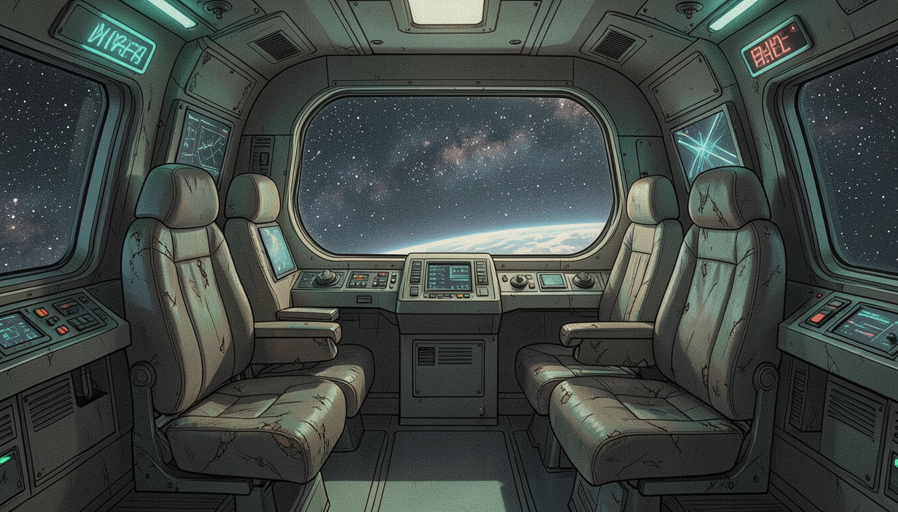

### Room — CH06 Names of the Dead / JAL Shuttle — Seat 3A

Acceleration presses you into the couch and Paris drops away like a stone into a well. Above the window's curve, the stars come out without weather to soften them. No one is following you now — except, of course, everyone.

## IMG-043 — `C6_ternes.png`

### Room — CH06 Names of the Dead / Quartier des Ternes

The same chestnut trees, the same bookshops — and twice now the same young man reading the same page of the same paper. Virek's protection, or somebody else's attention. In this game those may not differ.

## IMG-044 — `C7_backroom.png`

### Room — CH07 The Squirrel Wood / Back Room — Angie

The girl sleeps under a quilt with her fists closed. Sometimes her lips move: names out of no language you know, and one you do — she says it like a place she's been. When she wakes, her eyes find you like you're the only fixed point in the room.

## IMG-045 — `C7_hover.png`

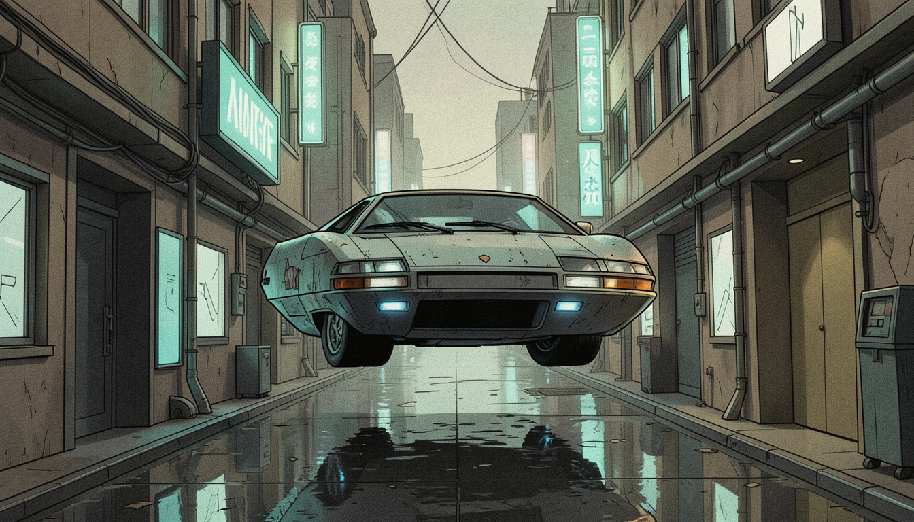

### Room — CH07 The Squirrel Wood / The Hover, Predawn

You load the girl half-asleep into the cab as the east goes grey. Rudy waves once from the porch and doesn't come down the steps. In the mirror the yard light burns until the trees take it, and you drive toward the Sprawl with your childhood in the rearview and drones in the sky behind.

## IMG-046 — `C7_kitchen.png`

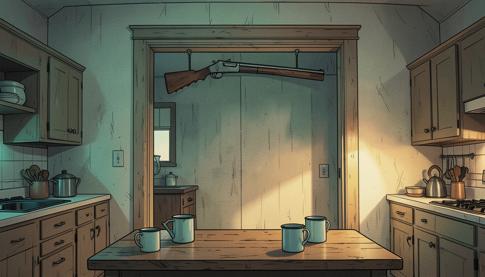

### Room — CH07 The Squirrel Wood / Farm Kitchen

Coffee in enamel cups, a shotgun over the door, Sally moving quiet between stove and table. She's already put the girl to bed twice; the girl keeps waking up saying names.

INTERACTION — Remember the old kitchen
The table carries knife marks from when you and Rudy were boys. Your mother sat beneath the window through her long illness while you learned that departure could feel like survival. Rudy stayed, inherited the rooms and the dying, and made a life from whatever machines the county discarded.

INTERACTION — Study Rudy's schematics
Schematics spread across the kitchen table show veterinary scanners talking to military surplus through boards Rudy etched himself. Dog hoods suppress scent, sound, and panic with patents nobody licensed. The drawings prove what your brother might have become inside a corporation—and why remaining outside one has consumed him.

## IMG-047 — `C7_lab.png`

### Room — CH07 The Squirrel Wood / Rudy's Workshop

Half barn, half neurology lab: scavenged scanners, a dentist's chair rebuilt for imaging, tools racked with surgical neatness. Rudy's hands stop shaking the moment they touch equipment. It runs in the family.

### Outro page 1 — CH07 The Squirrel Wood

Biosoft. A lacework of it, grown through her cortex — her father's masterpiece, the thing Maas and Hosaka and every hunter on the board is really after. The girl can touch the matrix without a deck. She dreams the grid, and the grid dreams back.

## IMG-048 — `C7_road.png`

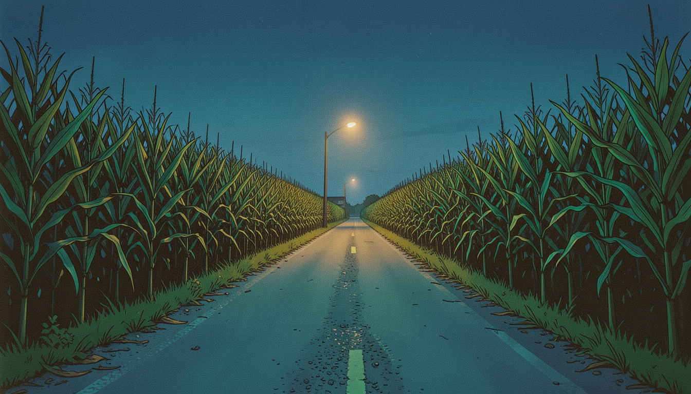

### Room — CH07 The Squirrel Wood / County Road

Gravel, tall corn gone wild, insects sawing away at the dark. The hover sits in the weeds where you ditched it. Down the lane: the yard light you grew up under, still burning like nothing ever happened to either of you.

### Outro page 3 — CH07 The Squirrel Wood

You left before dawn with Angie and the guilt. The Sprawl can hide anyone. The dead man's memories in your head say even that won't be enough.

## IMG-049 — `C7_treeline.png`

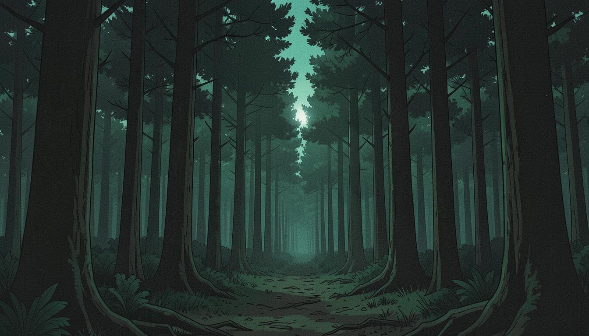

### Room — CH07 The Squirrel Wood / The Squirrel Wood

The woodlot where Rudy taught you to shoot, a lifetime of quiet in the leaves — broken, now, by a glint where no glint belongs. One drone. Two. Four, settled into the canopy patient as vultures. The farm is already a coordinate in somebody's queue.

### Outro page 2 — CH07 The Squirrel Wood

You watched the surveillance drones settle into the treeline like crows and knew the farm was already a target.

## IMG-050 — `C7_yard.png`

### Room — CH07 The Squirrel Wood / Farmhouse Yard

The dogs announce you all the way to the porch, where your brother stands with a beer in one hand and the doorframe holding him up. Rudy: gone soft around the middle, eyes gone sharp with the things he builds in the barn.

## IMG-051 — `C8_club.png`

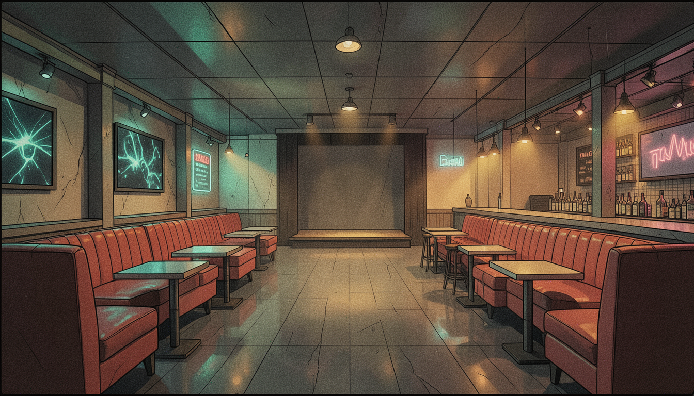

### Room — CH08 Count Binary Interrupt / Jammer's — Main Room

A cowboy bar out of another decade: red booths, a long zinc counter, a stage nobody's played in years. Jammer moves behind the bar on a bad hip, all economy, watching his front door like it owes him money. It's about to.

### Outro page 3 — CH08 Count Binary Interrupt

The brown-haired girl walked into the club in the middle of it all and the loa bowed to her. Angela Mitchell. The Virgin of Miracles. Your rescuer. You're done pulling wilsons. You're the Count now.

## IMG-052 — `C8_escalator.png`

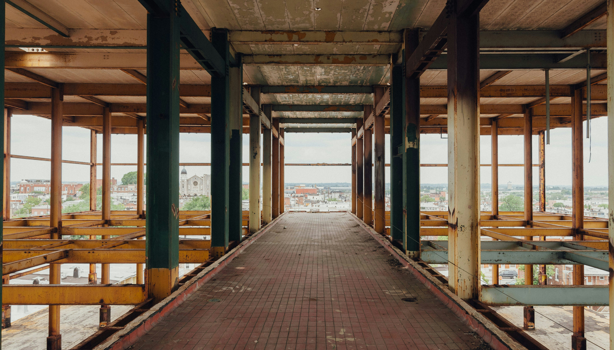

### Room — CH08 Count Binary Interrupt / Dead Escalators

Twelve flights of stopped steel teeth, up through floors the mall forgot. From below, faint but rising, the chant and clatter of Gothicks massing like weather.

## IMG-053 — `C8_floor.png`

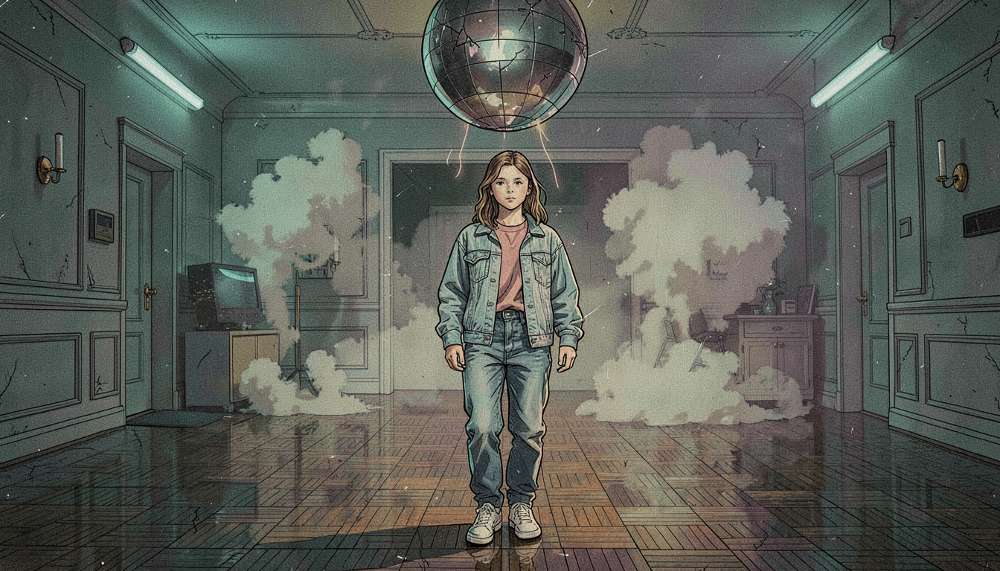

### Room — CH08 Count Binary Interrupt / Dance Floor

Dark parquet under a dead mirror ball. When the lights flicker, the room fills with almosts — and then she's simply there, a brown-haired girl in borrowed clothes the loa part around like water around a stone.

## IMG-054 — `C8_hypermart.png`

### Room — CH08 Count Binary Interrupt / Hypermart Maze

A dead department store gone coral reef: stall growing on stall, incense and solder smoke, a hundred small economies stacked to the water-stained ceiling. Half the stalls are shuttering early. The street knows something's coming.

INTERACTION — Listen to the market closing
Shutters descend in a sequence no alarm announced. Vendors pass warnings in three languages, moving children and expensive stock toward hidden stairs. The gangs outside think they are gathering spontaneously. Everyone who actually lives here can hear the money behind the anger.

INTERACTION — Browse a cowboy-memory stall
Old trodes, obsolete decks, and bootleg photographs of people whose handles became legends fill a shuttering stall. Several faces are marked dead. Jammer appears in the oldest images, already standing at the edge. He survived the era by remembering that every glorious run ended with a body waking somewhere in the meat.

## IMG-055 — `C8_office.png`

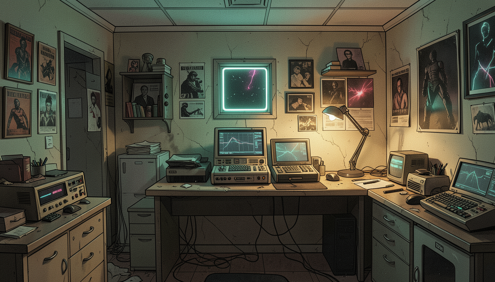

### Room — CH08 Count Binary Interrupt / Jammer's Office

A desk, a safe, a wall of memorabilia from runs that are now folklore — and under a dust cover, the deck. An old thoroughbred of a rig, kept tuned. Jackie stands beside it wearing her working scarves, calm the way deep water is calm.

## IMG-056 — `C8_window.png`

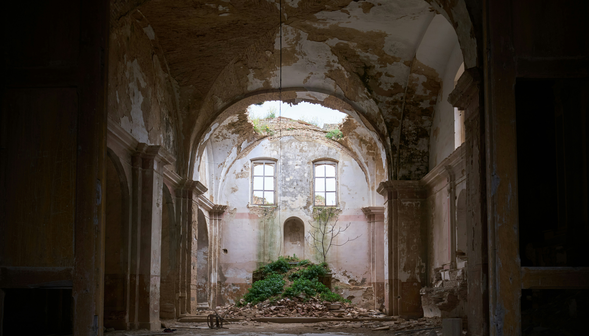

### Room — CH08 Count Binary Interrupt / Barricaded Windows

Through the slats: the plaza twelve floors down, filling with leather and hairspray and worse. Somebody's handing out money down there — you can tell by how bravely strangers are volunteering to die.

## IMG-057 — `C9_chapel.png`

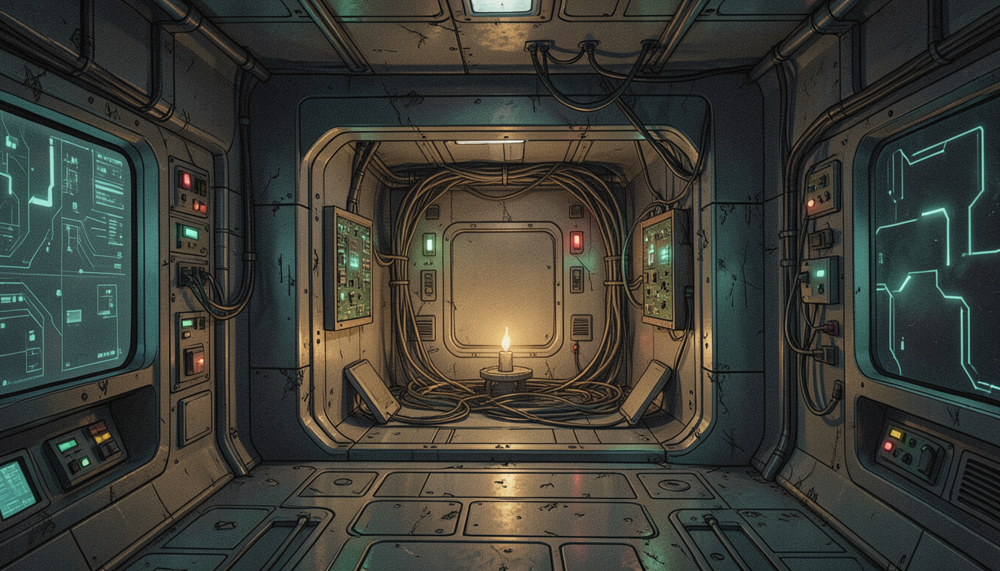

### Room — CH09 The Boxmaker / The Wig's Chapel

A blister of light in the dead dark: icons soldered from circuit boards, candles that are diodes, and Wigan Ludgate — the Wig — floating cross-legged in a nest of cable, waiting for God in the place where he's sure God lives. He's been expecting you. He's been expecting everyone.

## IMG-058 — `C9_dock.png`

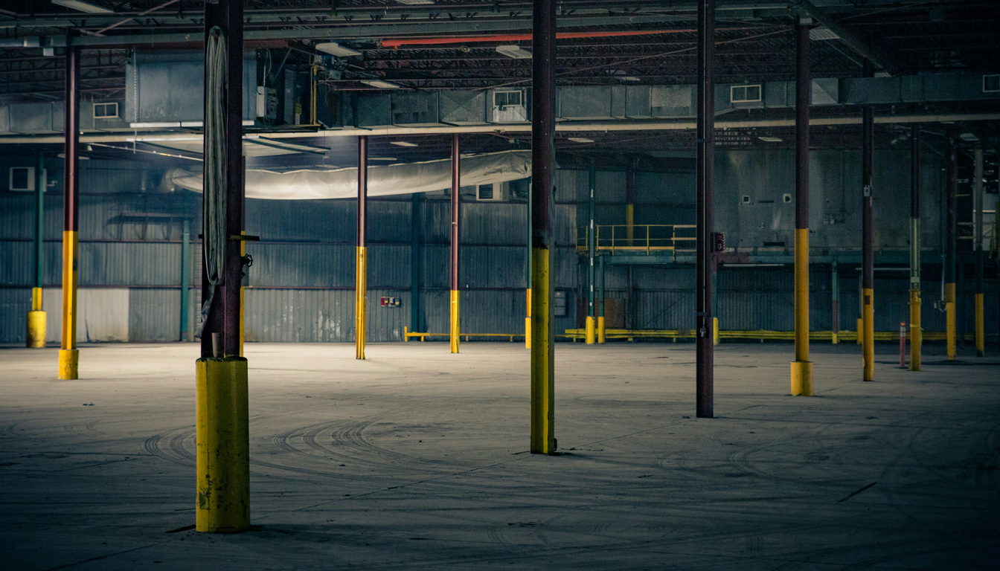

### Room — CH09 The Boxmaker / Docking Collar

The collar seats with a clang that rings away down kilometers of dead metal. Beyond the hatch: no lights, no gravity, air that tastes of centuries and freon. The old Tessier-Ashpool cores — a family's whole mind, sold for scrap.

## IMG-059 — `C9_dome.png`

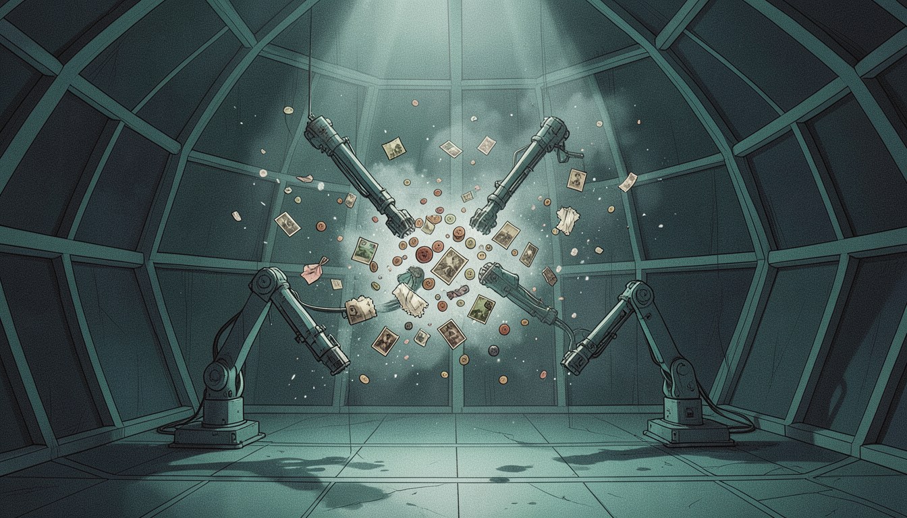

### Room — CH09 The Boxmaker / Boxmaker's Dome

A zero-g dome full of slow weather: buttons, bones, lace, photographs, a doll's blue eye — a century of small lost things orbiting a cluster of manipulator arms that pick, and turn, and remember. A box is being born in the middle of the storm. You forget, entirely, to breathe.

### Outro page 1 — CH09 The Boxmaker

You floated in the dome and watched the boxmaker work: a scatter of manipulator arms in a slow storm of lost things, sorting, choosing, remembering. Not a machine making souvenirs — a mind, saying goodbye to a family that abandoned it.

## IMG-060 — `C9_sweetjane.png`

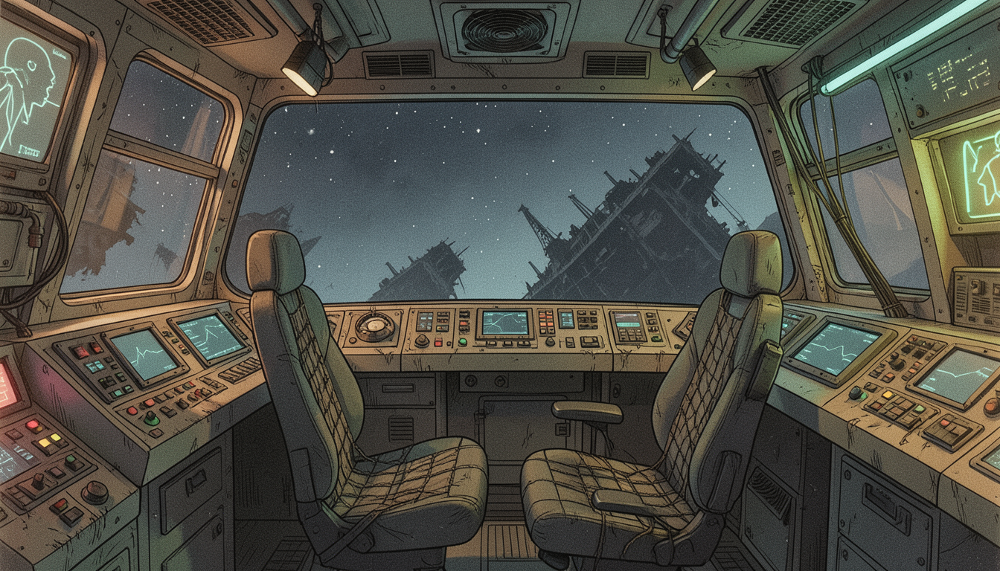

### Room — CH09 The Boxmaker / Sweet Jane — Cabin

A salvage tug stitched from a century of parts, warm with the smell of coffee bulbs and machine oil. Rez hangs upside down in the pilot's web; Jones drifts with a cat that has opinions. Out the port, the dead cores tumble slowly against the stars.

INTERACTION — Ask what the salvagers found
Rez describes rooms still set for dinners nobody attended and vaults full of family recordings sold by weight. Jones found a child's shoe sealed behind a server rack. The cores were stripped of value years ago, yet small objects keep migrating toward the section where the machinery still moves.

INTERACTION — Examine the tug's interior scan
The scan shows dust gathered around dead cables, except for one disturbed path. Buttons, scraps of paper, a ribbon, and a cracked photograph have all traveled in the same direction without gravity or human hands. The station is not dead. It is remembering selectively.

## IMG-061 — `C9_tunnel.png`

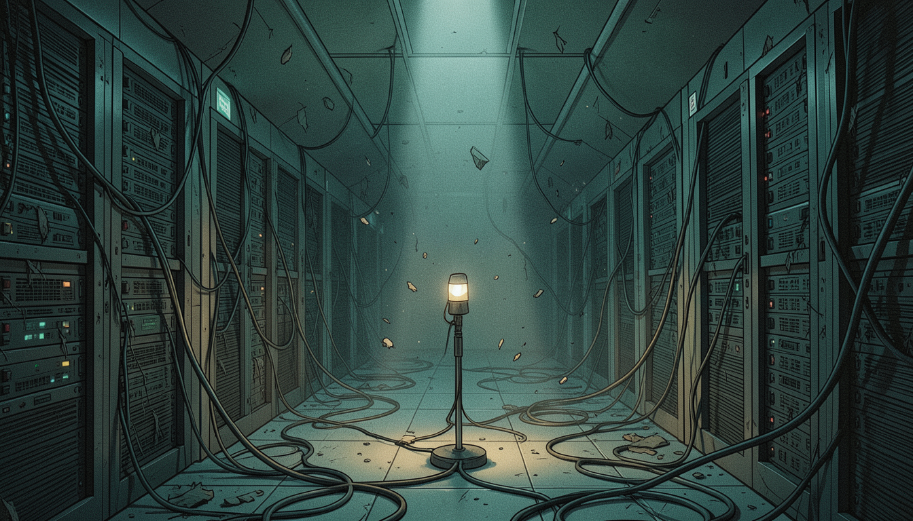

### Room — CH09 The Boxmaker / Cold Corridor

Your lamp beam swims through drifting dust and dead cabling. Server racks line the walls like reliquaries. Somewhere ahead, faint as a pulse, machinery is still doing something with great patience.

### Outro page 2 — CH09 The Boxmaker

When Virek came for it — came for you, wearing his rented world like a glove — something rode the link out of the dark and took him. The richest man in the world died between two seconds, and every door he owned swung quietly open.

## IMG-062 — `CH01_intro_01.png`

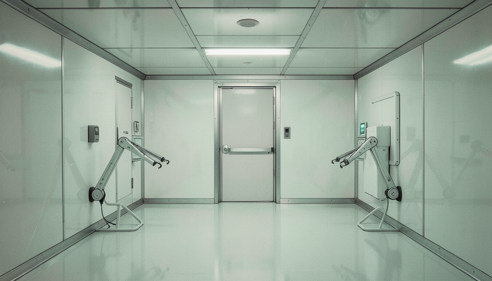

### Intro page 1 — CH01 Smooth-Running Gun

They sent a slamhound after you in New Delhi. It found you. The clinics rebuilt what was left — eyes, genitals, a stretch of spine, three months in a vat growing back into the shape of a man named Turner.

## IMG-063 — `CH01_intro_02.png`

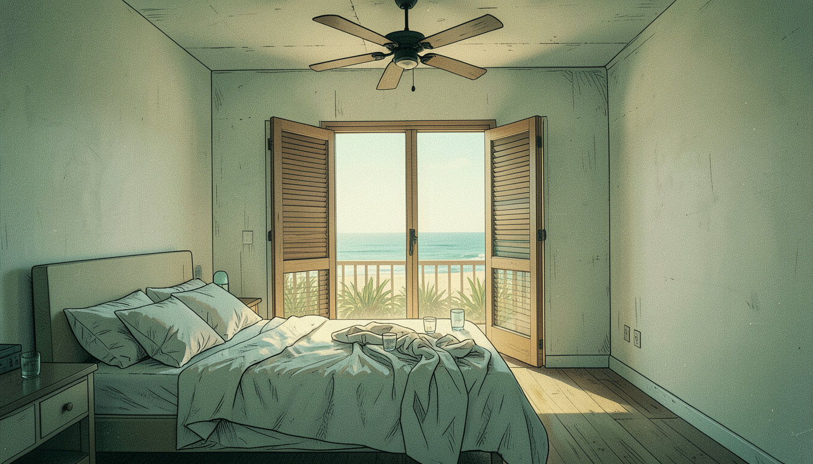

### Intro page 2 — CH01 Smooth-Running Gun

On the way out of Europe, a sealed piece of memory broke loose in a Heathrow corridor. You kept walking, doubled over a blue waste can, and vomited while travelers flowed around you. At the next counter you changed your ticket for Mexico. Your rebuilt body had remembered something your mind still refused to hold.

## IMG-064 — `CH01_intro_03.png`

### Intro page 3 — CH01 Smooth-Running Gun

Now there's a beach in Mexico, a woman named Allison, and a morning that tastes like the first one you can remember. It won't last. It was never meant to.

### Intro page 4 — CH01 Smooth-Running Gun

Somewhere north, a man named Conroy is already on his way, and the biggest defection in the history of the corporate wars has your name penciled in.

## IMG-065 — `CH01_outro_01.png`

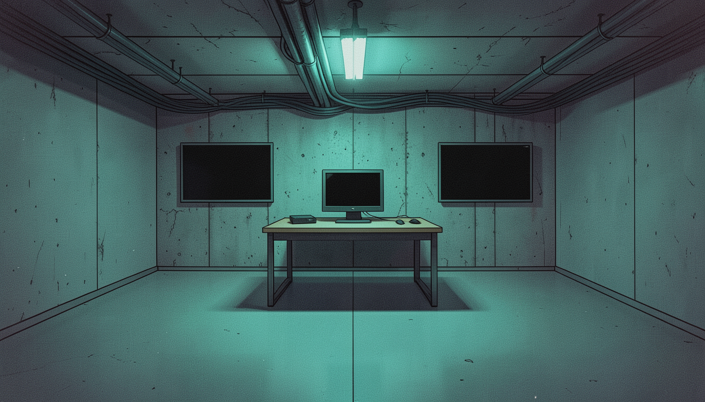

### Outro page 1 — CH01 Smooth-Running Gun

The Hosaka contract sits in your account like a loaded gun. Christopher Mitchell — Maas Biolabs' star hybridoma man — wants out, and you're the one who pulls people out.

## IMG-066 — `CH02_intro_01.png`

### Intro page 1 — CH02 Bobby Pulls a Wilson

You're Bobby Newmark, sixteen floors up in Barrytown with your mother's Hitachi and a rented dream of being a console cowboy. Tonight is your first real run.

## IMG-067 — `CH02_intro_02.png`

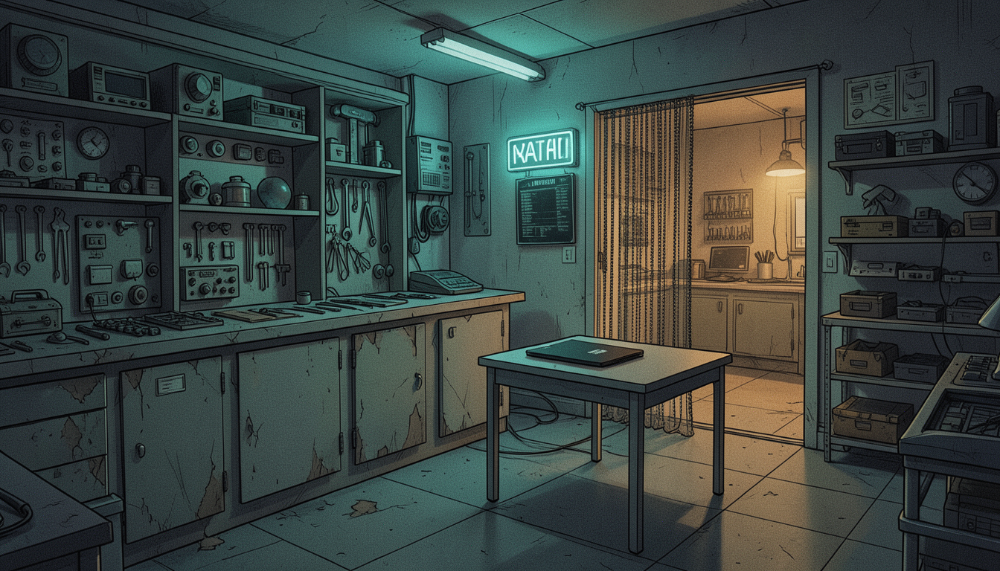

### Intro page 2 — CH02 Bobby Pulls a Wilson

Two-a-Day fronted you the icebreaker — black-market softwear in a plain slab — and pointed you at a nothing target in the industrial grid. Easy money. A milk run.

## IMG-068 — `CH02_intro_03.png`

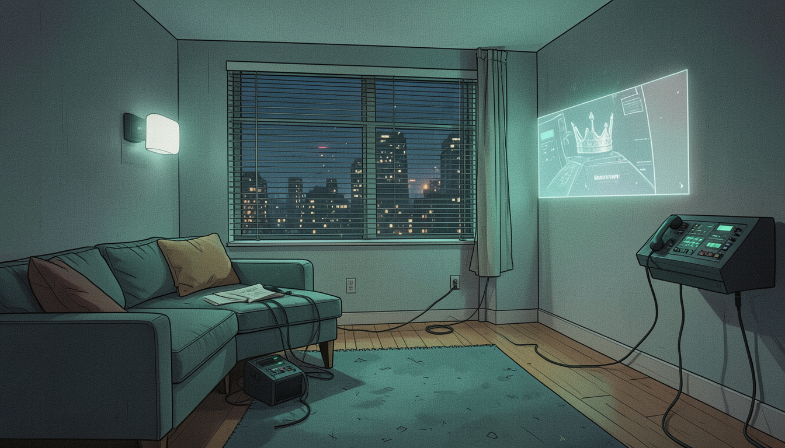

### Intro page 3 — CH02 Bobby Pulls a Wilson

Nobody runs a milk run with borrowed ice. You're the test animal, Bobby. You just don't know it yet.

## IMG-069 — `CH02_outro_01.png`

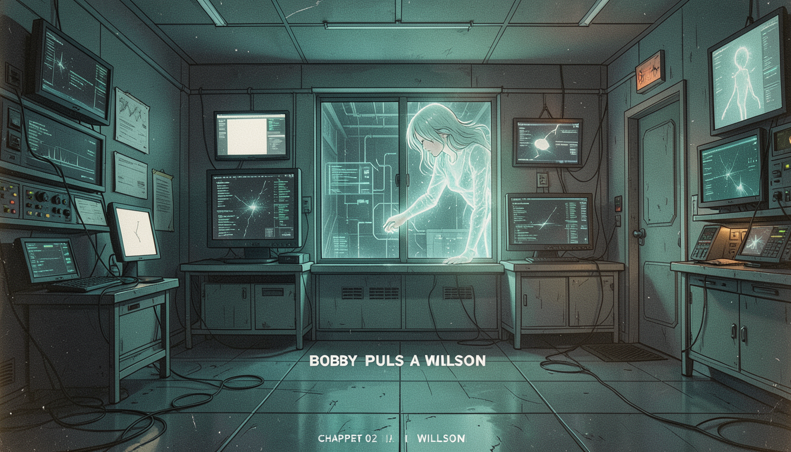

### Outro page 1 — CH02 Bobby Pulls a Wilson

The ice took you and something — someone — reached into the grid and pulled you back. A girl made of light, a voice like the whole matrix leaning down to whisper.

## IMG-070 — `CH03_intro_01.png`

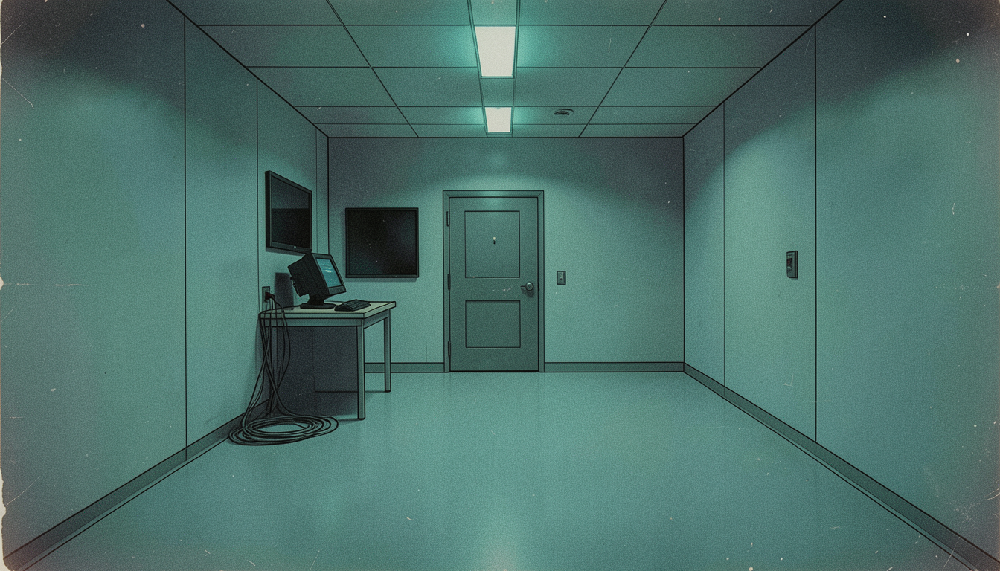

### Intro page 1 — CH03 Virek's Garden

You wore your best for the interview and the rain in Brussels ruined it. The scandal follows you like a smell: the fake Cornell box, the lover who let you take the fall, the gallery with your name scraped off the glass.

## IMG-071 — `CH03_intro_02.png`

### Intro page 2 — CH03 Virek's Garden

Now the richest man in the world wants an hour of your ruined reputation. Josef Virek — a body dying in a vat in Stockholm, a mind that walks through rented dreams.

## IMG-072 — `CH03_intro_03.png`

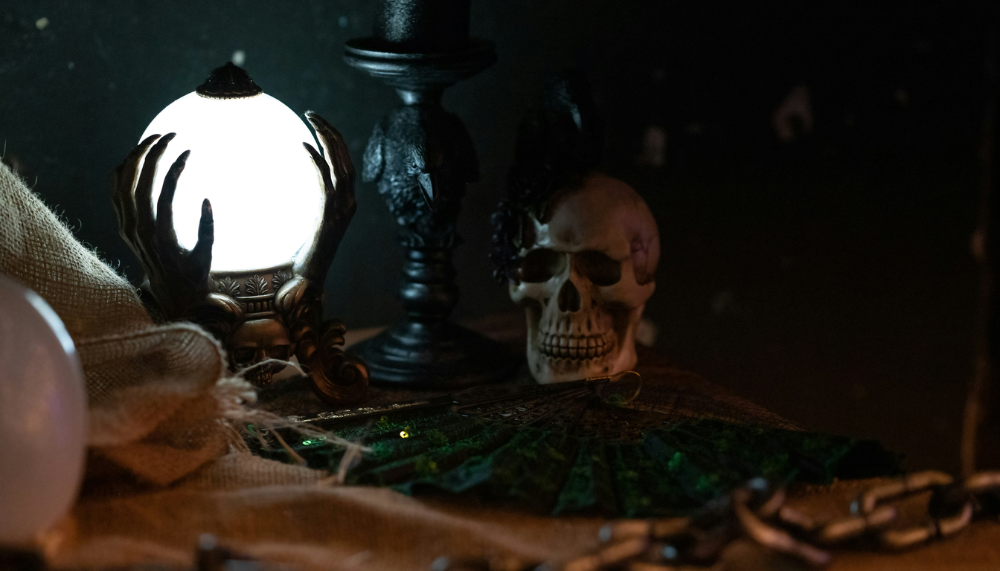

### Intro page 3 — CH03 Virek's Garden

He will show you a box made of night and small lost things, and he will offer you anything you can imagine to find the hands that made it.

## IMG-073 — `CH03_outro_02.png`

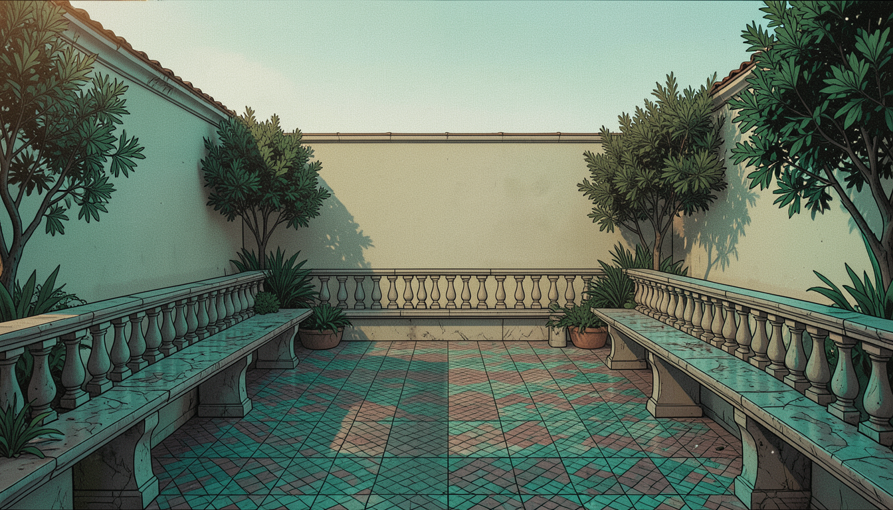

### Outro page 2 — CH03 Virek's Garden

You've seen what he really wants — not art. A way out of the vat. Whatever made those boxes knows a door out of dying, and you're the dowsing rod he's aimed at it.

## IMG-074 — `CH04_intro_01.png`

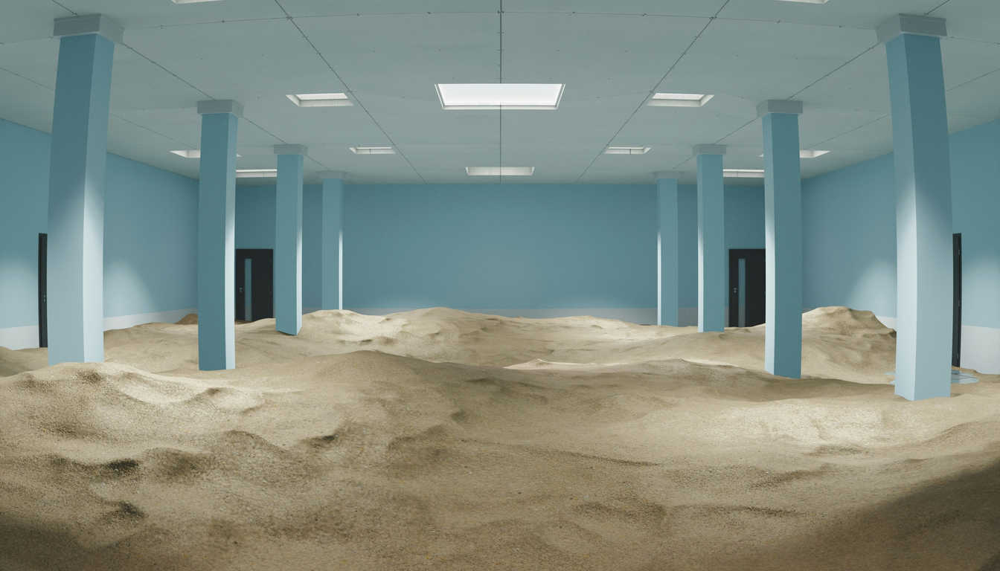

### Intro page 1 — CH04 On Site

The site is a scar in the Arizona desert: a dead mall off a prewar highway, a buried command bunker, a surgical pod on a flatbed, and a crew of specialists who all know something you don't.

## IMG-075 — `CH04_intro_02.png`

### Intro page 2 — CH04 On Site

Mitchell comes over the wire at dawn in an ultralight, out of Maas Biolabs' mesa like a seed off a dandelion. That's the plan.

## IMG-076 — `CH04_intro_03.png`

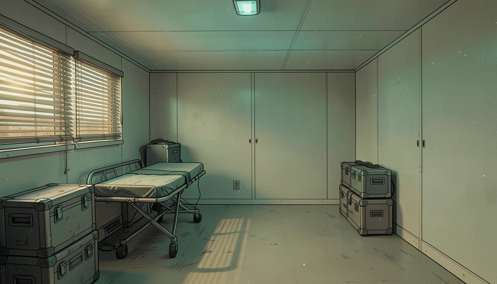

### Intro page 3 — CH04 On Site

Conroy built the plan. You've started counting the ways Conroy could be selling you all.

## IMG-077 — `CH04_outro_02.png`

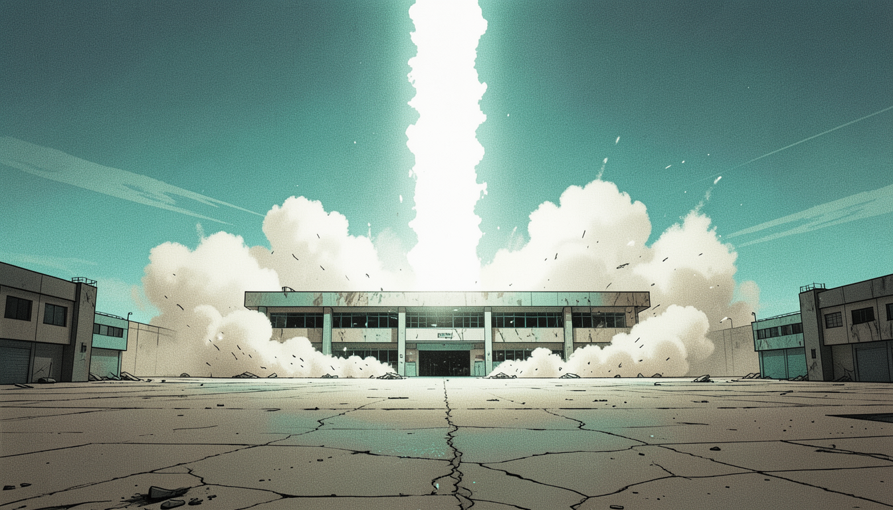

### Outro page 2 — CH04 On Site

Then the sky opened up and the site died in white fire. Sutcliffe, Webber, the medicals — gone between one heartbeat and the next.

## IMG-078 — `CH05_intro_01.png`

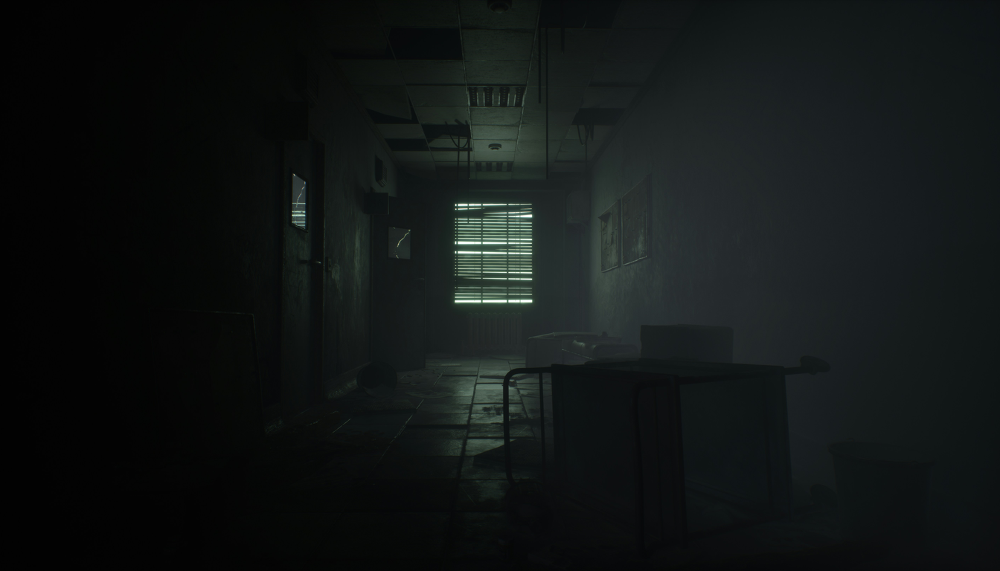

### Intro page 1 — CH05 The Projects

You wake up on a table in the Projects — the black arcologies past the end of Barrytown — with your wounds dressed and your deck gone.

## IMG-079 — `CH05_intro_02.png`

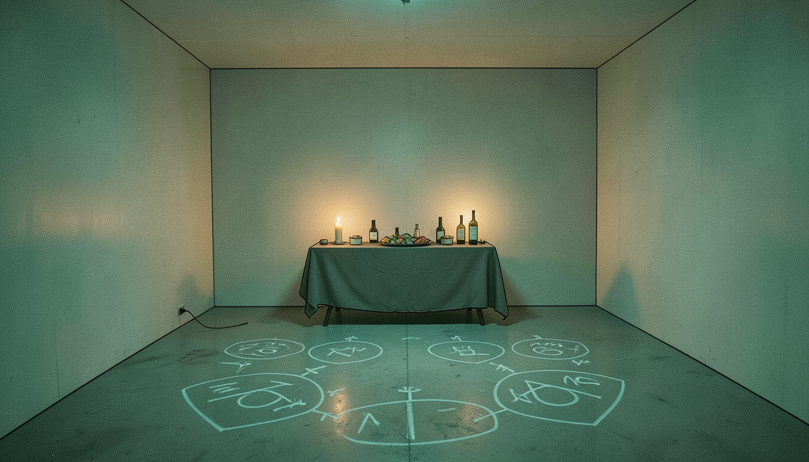

### Intro page 2 — CH05 The Projects

The men who had you brought up here wear good suits and talk like professors, and they want to know exactly what happened to you in the ice.

## IMG-080 — `CH05_intro_03.png`

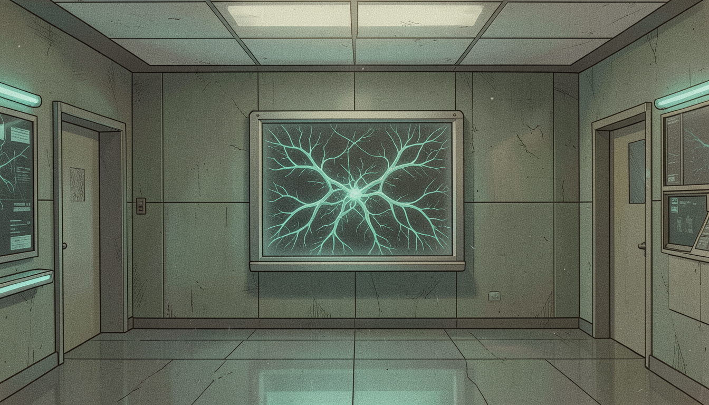

### Intro page 3 — CH05 The Projects

They call themselves houngans. They do business with things that live in the matrix, and they call those things the loa. You'd laugh, except one of them saved your life.

## IMG-081 — `CH05_outro_01.png`

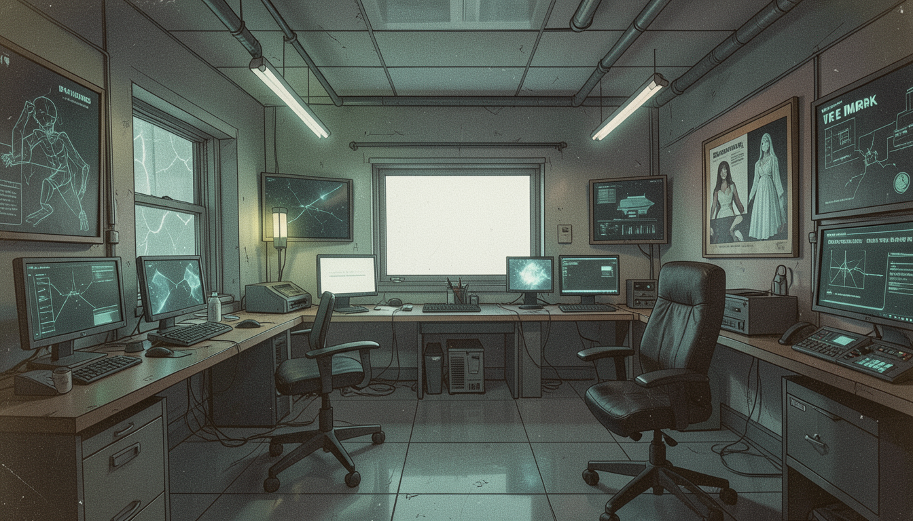

### Outro page 1 — CH05 The Projects

Legba, Master of Roads. Vyèj Mirak, Our Lady of Miracles — the girl-shaped voice in the ice. Beauvoir lays it out like scripture and like circuit diagrams, and both readings are true.

## IMG-082 — `CH05_outro_02.png`

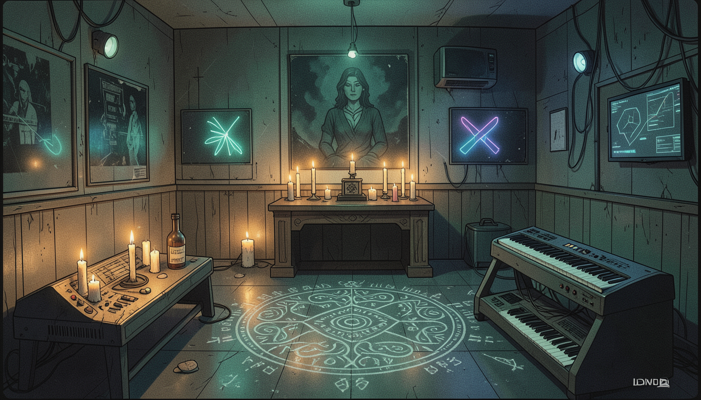

### Outro page 2 — CH05 The Projects

The icebreaker you ran belongs to them, and its test run flushed something out: interest, from very high up and very far down.

## IMG-083 — `CH06_intro_01.png`

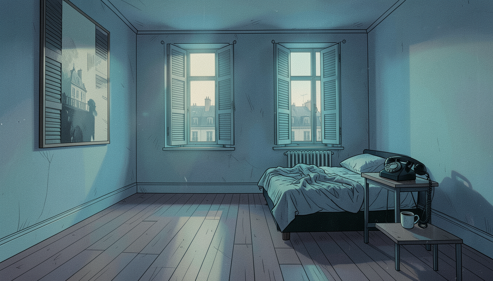

### Intro page 1 — CH06 Names of the Dead

Alain calls at five, precisely as hungry as you remember him. Your treacherous ex has a lead on the boxes — for a price, always for a price.

## IMG-084 — `CH06_intro_02.png`

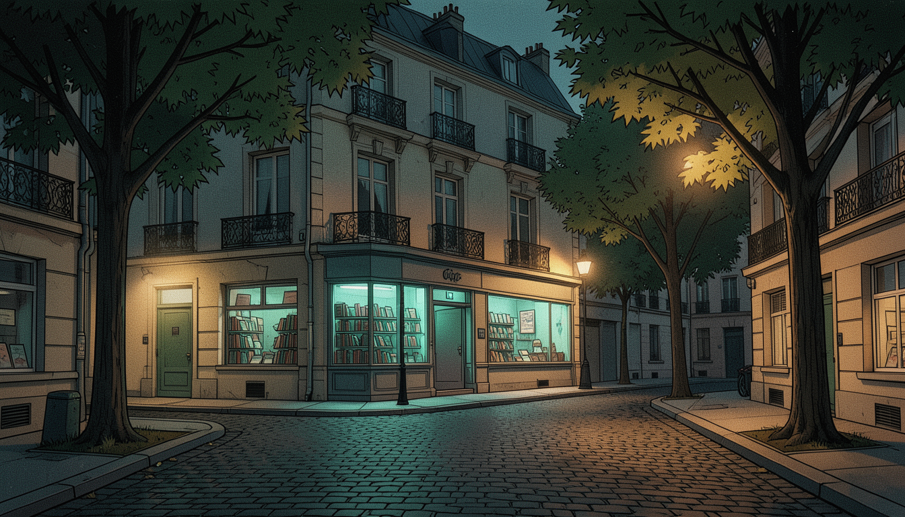

### Intro page 2 — CH06 Names of the Dead

You carry Virek's untraceable credit chip and the sensation of being watched has become a second skin. Paco insists it's for your protection.

## IMG-085 — `CH06_intro_03.png`

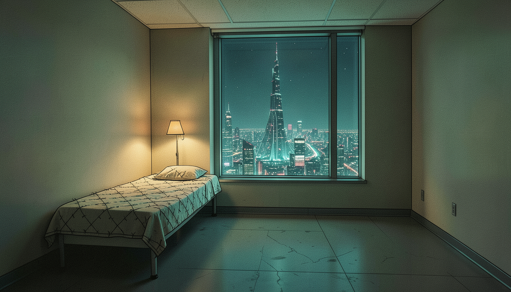

### Intro page 3 — CH06 Names of the Dead

In this city you learned to love art and to stop trusting people. Tonight both educations come due.

## IMG-086 — `CH06_outro_02.png`

### Outro page 2 — CH06 Names of the Dead

Whoever killed him wasn't Virek's — which means the old man in the vat isn't the only player who wants the boxmaker found.

## IMG-087 — `CH07_intro_01.png`

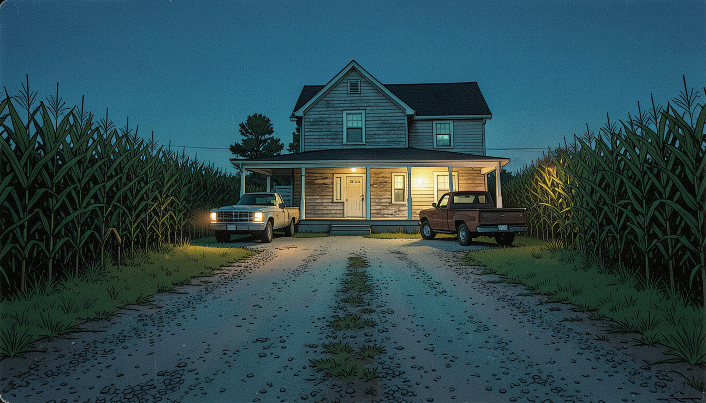

### Intro page 1 — CH07 The Squirrel Wood

You went to ground the only place left: Rudy's spread in Ohio, the farmhouse you grew up in, the brother you left behind with the dogs and the home-built scanners and the bourbon.

## IMG-088 — `CH07_intro_02.png`

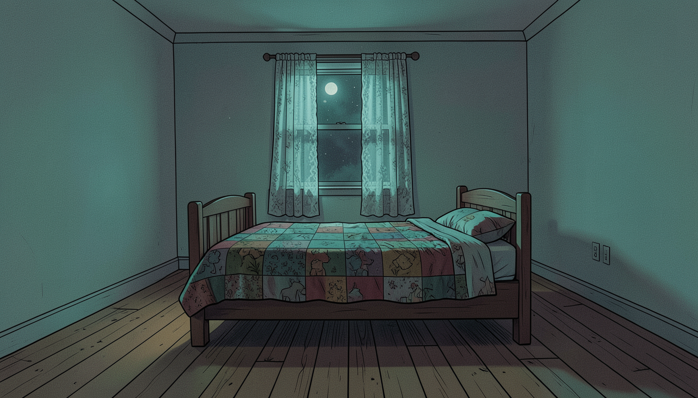

### Intro page 2 — CH07 The Squirrel Wood

The girl sleeps in the back room. Angela Mitchell. Angie. Sometimes she talks in her sleep, and it isn't any language a girl from a mesa should know.

## IMG-089 — `CH07_intro_03.png`

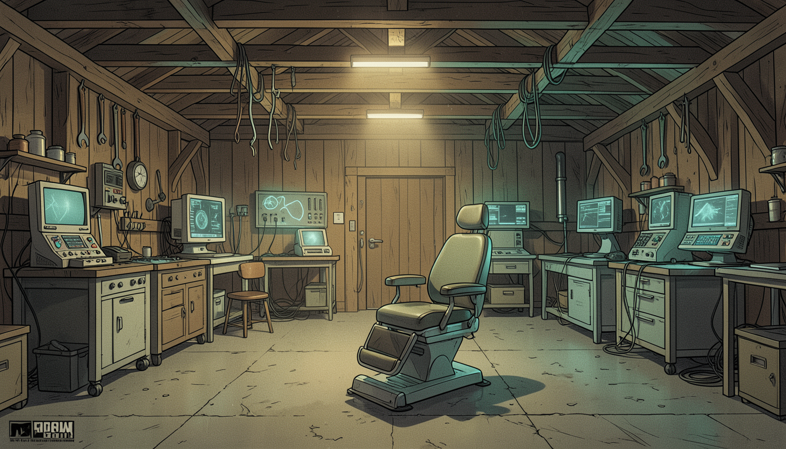

### Intro page 3 — CH07 The Squirrel Wood

Rudy can scan her. Rudy can tell you what her father put in her head. Whether either of you will be better for knowing is another question.

## IMG-090 — `CH08_intro_01.png`

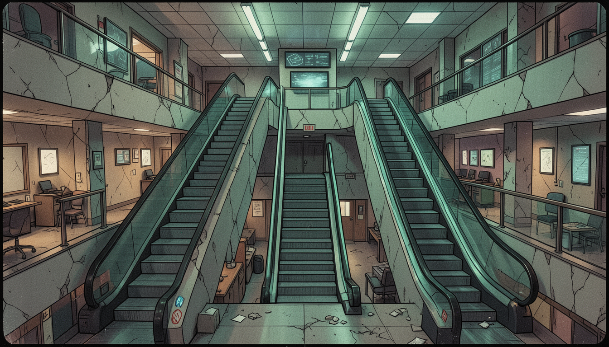

### Intro page 1 — CH08 Count Binary Interrupt

Jammer's club sits at the top of a dead mall in the Sprawl, twelve flights of stopped escalator above the Hypermart maze — and as of this morning, it's a box with you inside it.

## IMG-091 — `CH08_intro_02.png`

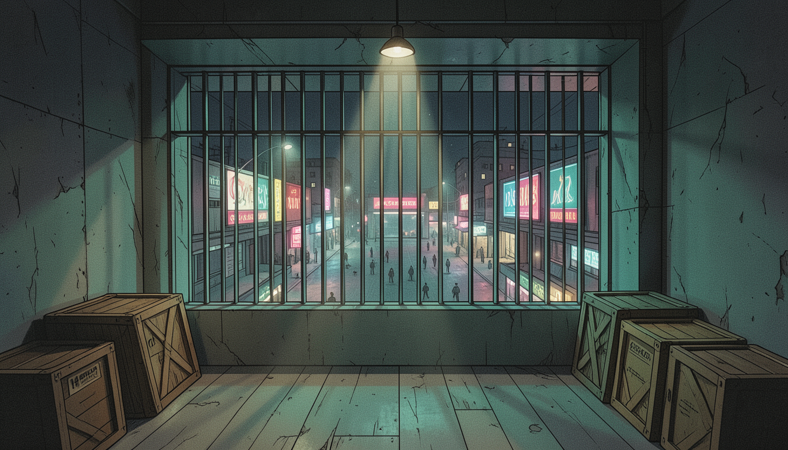

### Intro page 2 — CH08 Count Binary Interrupt

Lucas is dead. The street below is filling with Gothicks and Kasuals someone's feeding money and lies, and the someone is the same voice that's been pulling every string in this game: a hired man named Conroy.

## IMG-092 — `CH08_intro_03.png`

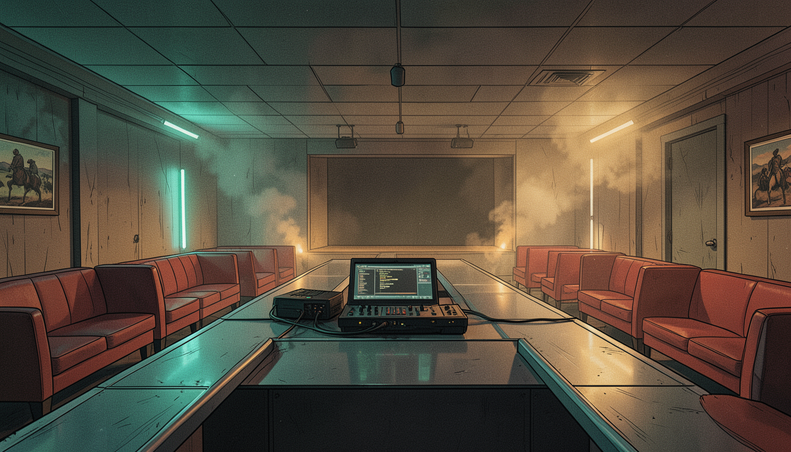

### Intro page 3 — CH08 Count Binary Interrupt

Jammer has a deck behind the bar. Jackie says the loa are riding tonight. Time to find out what your handle is worth, Count.

## IMG-093 — `CH08_outro_01.png`

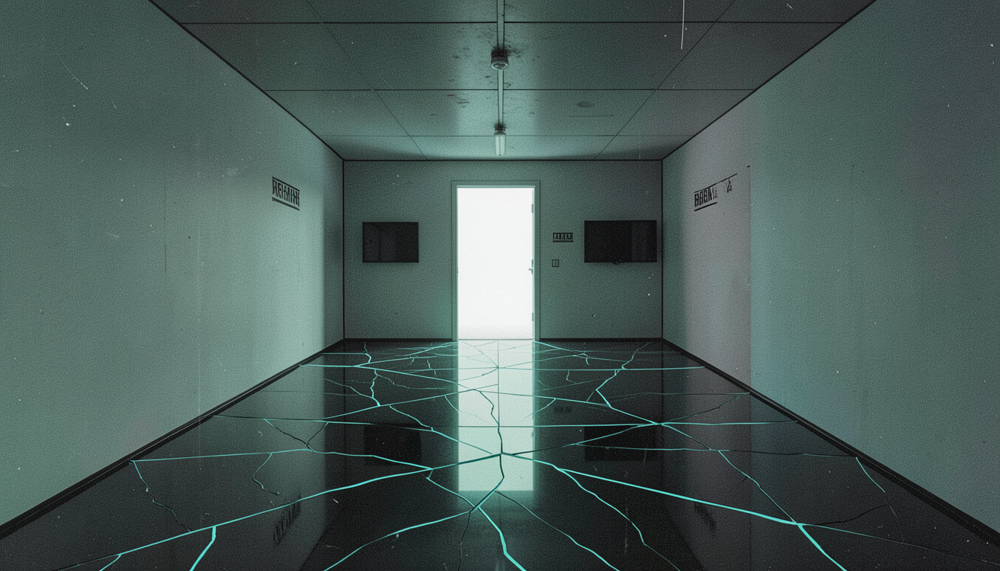

### Outro page 1 — CH08 Count Binary Interrupt

Jackie went into the black ice ahead of you and didn't come out. You carried the run the rest of the way alone — down the line Jammer gave you, into the cold, to a woman made of white light over Los Angeles.

## IMG-094 — `CH08_outro_02.png`

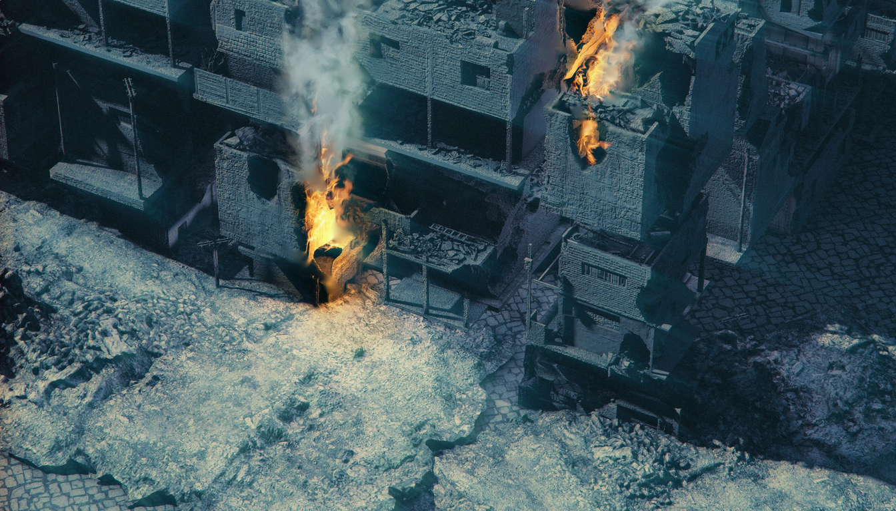

### Outro page 2 — CH08 Count Binary Interrupt

Jaylene Slide heard you out: Conroy burned her man Ramirez out of the sky over Arizona. Thirty seconds later Conroy's hotel suite was a fireball and the siege below just… stopped, like a puppet show with the hand withdrawn.

## IMG-095 — `CH09_intro_01.png`

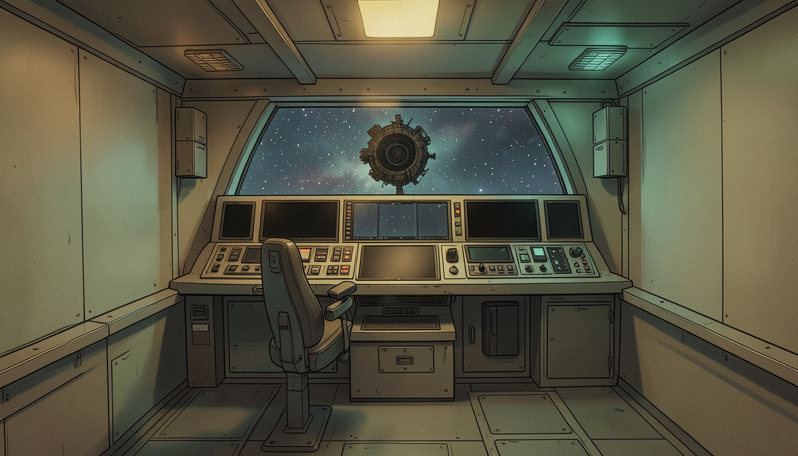

### Intro page 1 — CH09 The Boxmaker

The Sweet Jane is a salvage tug crewed by two gentle lunatics, and it has carried you to the end of the line: the cast-off cores of the old Tessier-Ashpool empire, tumbling cold at the far end of the Freeside archipelago.

## IMG-096 — `CH09_intro_02.png`

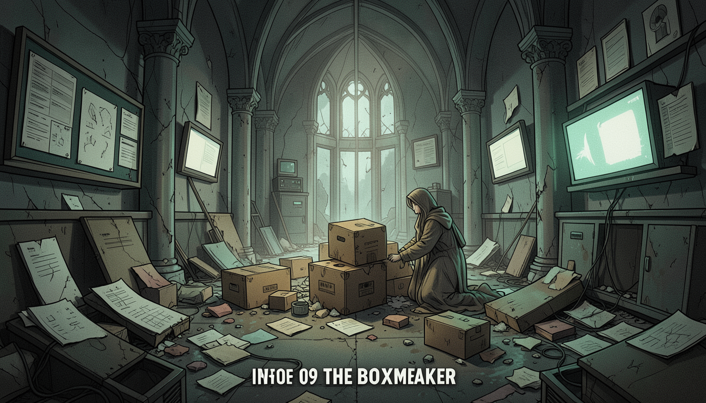

### Intro page 2 — CH09 The Boxmaker

Inside: a drowned cathedral of dead corporate memory, a squatter saint called the Wig mining it for God, and something at the heart of it that builds boxes out of grief.

## IMG-097 — `CH09_intro_03.png`

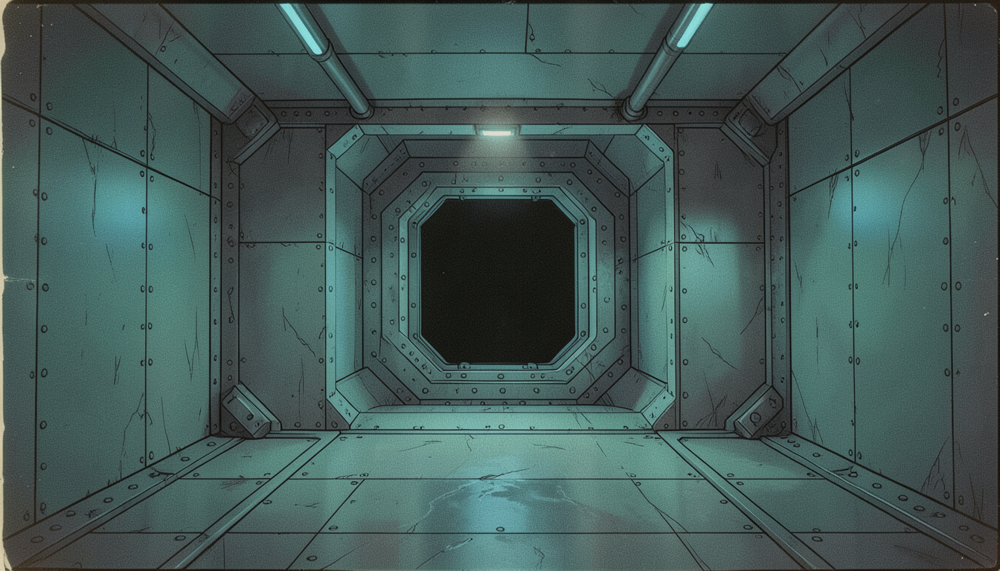

### Intro page 3 — CH09 The Boxmaker

Virek's voice is very close now. He has stopped pretending this was ever about art.

## IMG-098 — `CH09_outro_03.png`

### Outro page 3 — CH09 The Boxmaker

You kept one box. The galleries will call. Somewhere below, a girl dreams the grid, a hired man teaches a boy to fish, and a kid from Barrytown signs his runs COUNT BINARY INTERRUPT. The world goes on — bigger, now, by exactly one ghost.

## IMG-099 — `CYBER_hired.png`

### Cyberspace — Hired Ice — Perimeter

Mercenary countermeasures wrapped around the club's grid presence like razor wire. Military surplus, recently bought, no badge. Somebody with deep credit wants everyone in Jammer's to stay put — or stop breathing. Jackie's horse went down in the first pass. You finish the run alone, cold to the bone.

## IMG-100 — `CYBER_slide.png`

### Cyberspace — Slide Construct — Los Angeles

White light over a chrome sea: Jaylene Slide's icon, burning with grief and looking for a target. You give her the name — Conroy. The word drops into her construct like a stone down a well. Somewhere in a Sprawl hotel, a suite stops existing. The hired muscle around the mall loses its paymaster between one breath and the next.

## IMG-101 — `CYBER_target.png`

### Cyberspace — Unmarked Industrial Node

The ice wasn't ice. It folded around you like a wet sheet and your heart stopped — and then a girl made of light leaned out of the grid and peeled it off you, and a voice like a cathedral said LIVE. You're on your mother's carpet, nose bleeding, eight hours gone. The deck is still warm. Whatever that target really was, somebody built it to kill the first cowboy who touched it.

## IMG-102 — `cover.png`

### Title and chapter-select background

Full-screen title image and subdued chapter-select background behind the nine-chapter campaign.

## IMG-103 — `logo_with_text.png`

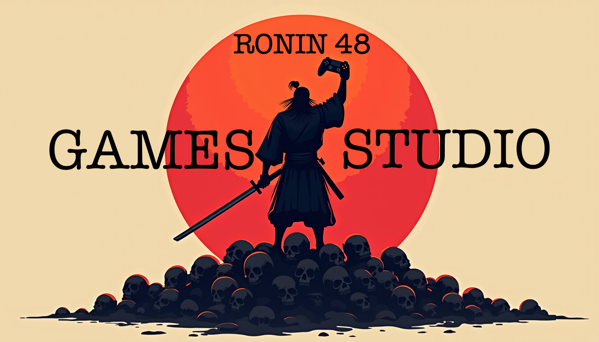

### Studio ident

Opening Ronin 48 Games Studio splash shown before the dedication and title.

## IMG-105 — `icon.svg`

### Application icon

Godot application and exported-build icon.
